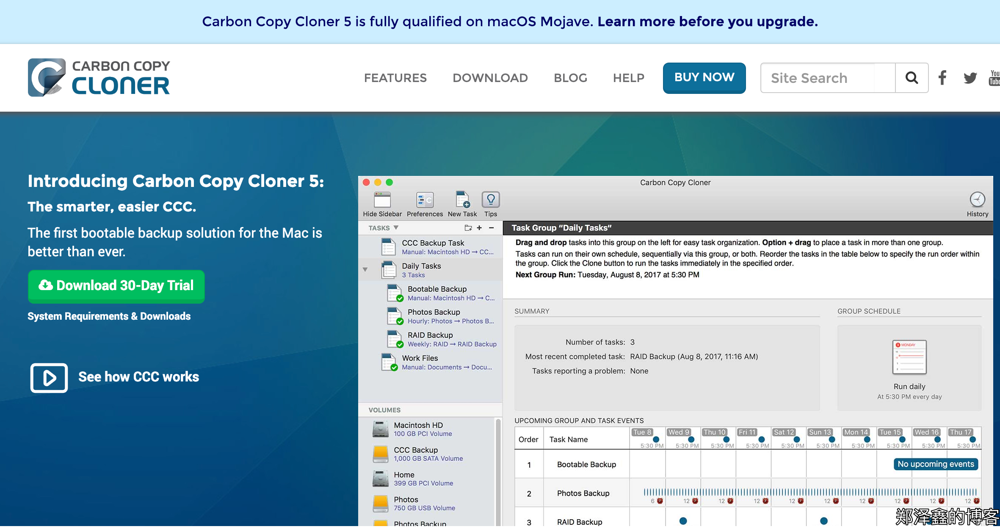
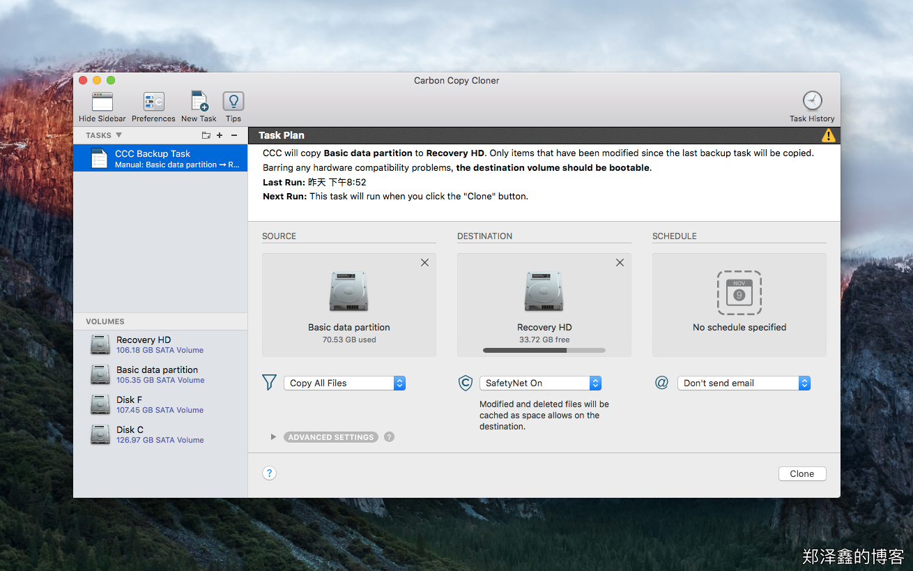
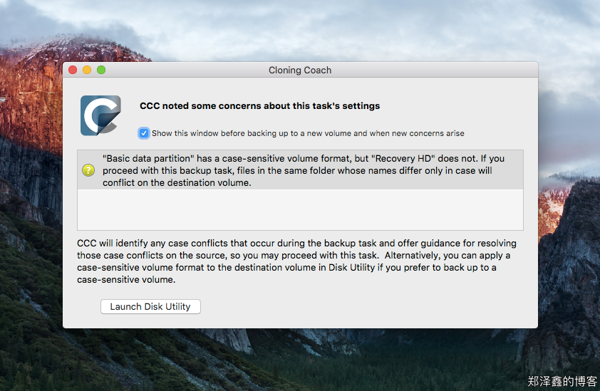
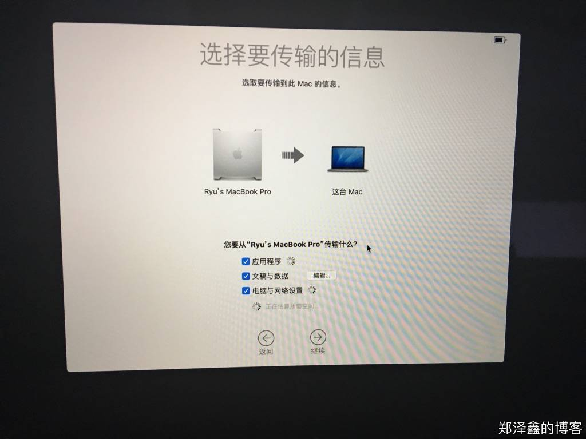

最近，入手了 MBP 2018，就想着将旧电脑的数据[使用“迁移助理”迁移到新 macbook](https://support.apple.com/zh-cn/HT204350)，但是打开迁移助理后却提示由于旧电脑的文件系统格式是“Mac OS 拓展（区分大小写，日志式）”（Case-sensitive, Journaled），而新 macbook 则是默认“Mac OS 拓展（日志式”（without the Case-sensitive），因此不支持数据迁移。

这可难倒我了，旧电脑使用了很久，里面有很多购买的软件，也有很有程序的设置和文件，如果要手动拷贝到新 macbook 上，无疑是很低效，而且效果也不好的。

## 初步搜索结果

于是我初步 Google 了一下，先是找到了2种方法：

 - 将新 macbook 格盘成大小写敏感重装系统，再数据迁移（缺点是新 macbook 的文件系统格式变成了大小写敏感）
 - 将旧电脑修改所有大小写重名的文件，做一个 TimeMachine，然后旧电脑格盘成大小写不敏感，再使用 TimeMachine 恢复，最后数据迁移（缺点是较繁琐，且旧电脑的数据被格掉，方法来自 [https://github.com/cr/MacCaseSensitiveConversion](https://github.com/cr/MacCaseSensitiveConversion)）

先说一下2个方法，第一个方法肯定可行，但是 macOS 默认大小写不敏感是有道理的，很多软件默认不支持大小写敏感的文件系统，比如我装 steam 平台时就遇到过。且目前而言，大小写不敏感的文件系统利大于弊，因此我决定使用大小写不敏感的文件系统，第一个方法被否掉。
 
第二个方法，其实也算比较冒险且繁琐，需要经历查找-重命名-备份-格盘-恢复-迁移的步骤，而且万一格盘后不能恢复（网上曾见过大小写敏感的 TimeMachine 不能被恢复成大小写不敏感），原始文件都没了。如果没有找到第三个方法，那么我可能被迫只能使用第二个方法了。

另外在Google 过程中，找到一个[名为“iDefrag”的软件（旧名称为“iPartition”）](https://coriolis-systems.com/)，有人称是可以进行大小写敏感的转换的，遗憾的是，该软件预计在19年7月份才更新到支持 macOS 10.10以上，因此同样放弃。
 
## 解决方法
 
碰巧的是，当我过了几天，再 Google 搜索时，居然找到有人使用 [Carbon Copy Cloner](https://bombich.com/) 将文件系统转换成大小写不敏感的经历，虽然是16年的帖子，但是有成功的经历，且我自己看了整个流程后，发现不用格盘，因此信心倍增。
 
流程如下：
 
  1. 下载 Carbon Copy Cloner（以下简称 CCC），安装，有30天的试用期，因此完全够用了； 
   

  2. 使用 CCC 将 Mac 系统盘备份到一个大小写不敏感的分区（此步我是在旧电脑的硬盘上分出1个足够大小的大小写不敏感分区，读者使用移动硬盘或者足够大小的 U 盘也是可以的）
   
   

  3. 检查备份是否成功，下图可见大小写重名冲突只是少量文件，因此我推测可以成功
   
   

  4. 挂载备份盘（备份盘分区时命名为 Recovery HD）
  5. 在“系统偏好设置”中，进入“启动磁盘”，并选择Recovery HD，重新启动
   
   

  6. 以 Recovery HD 重启 mac 系统，登录进入（会发现克隆了一个一模一样的环境，CCC 真强大）
  7. 此时我们已经拥有了一个大小写不敏感的 Mac 系统了，启动迁移助理，成功完成数据迁移!（最后需要提醒，使用数据迁移，尽量使用雷电数据线或者网线进行数据传输，速度将会快很多，70G 的数据迁移，~~WIFI 下需要12h 以上~~，网线情况下我只使用了约2h）
   

  ## 参考网页
   1. https://discussions.apple.com/thread/7546003
   2. https://forums.macrumors.com/threads/case-sensitive-to-normal.1969880/
   3. [macOS 文件系统的大小写敏感转换](https://twiceyuan.com/2018/12/11/MacCaseSensitiveConversion/)