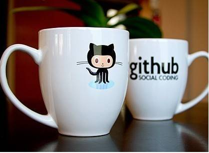
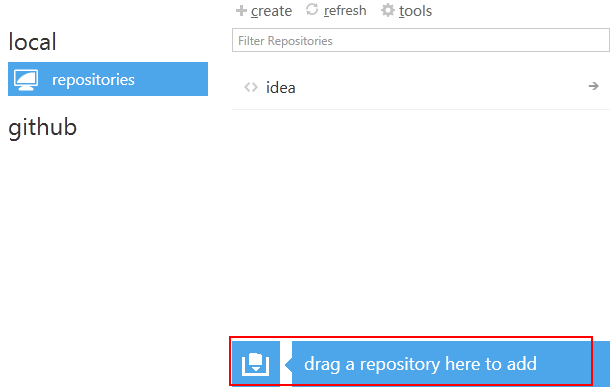

2013年，我也学别人，玩起了github，github真的是让我打开了另一个世界的一扇门，我发现编程的全新领域，居然有这样的社区，居然有这么开明的开源网站，实在是令人无比喜悦，一开始发现github，还是因为看到了用github pages建立博客，虽然这事很多人觉得不道德，但是我觉得github pages就该这么用，不过就看你放的是什么内容在上面；然后为了建立自己私人读书笔记，我最后放弃了申请免费的github仓库而是使用bitbucket，这两者都支持git，bitbucket还支持HR，其实根本不用考虑那么复杂，那么花哨，我们只需要github的客户端就行了。



##什么是git？

用github首先就先知道git是什么？其实git的概念很简单，就是版本控制系统，使用git，我们可以多次修改我们的源码，但是每一次修改的版本我们都可以对比，可以查看，这就变得很方便。

关于Git，大家还可以看看这些简明教程，都是非常好的&mdash;&mdash;

*   [图解Git](http://marklodato.github.io/visual-git-guide/index-zh-cn.html)
*   [git - 简易指南](http://rogerdudler.github.io/git-guide/index.zh.html)

##什么是github？

github是一个开源托管平台，也是很多编程者的互相改良、交流的平台，之所以吸引这么多人，一个是因为这里有非常多优秀的编程者，一个是因为这里是免费而又开源的，有这么一个平台，你可以follow你感兴趣的项目，你可以folk你改进的源码。

关于github，大家还可以参考这两篇文章，非常详细&mdash;&mdash;

*   [如何高效利用GitHub](http://www.yangzhiping.com/tech/github.html)

*   [搭建一个免费的，无限流量的Blog----github Pages和Jekyll入门](http://www.ruanyifeng.com/blog/2012/08/blogging_with_jekyll.html)

玩了github后，我自己也看了很多很优秀的项目，同时自己也玩了一把folk了别人的源码，可以说，github是非常方便的。

##为什么玩bitbucket？&nbsp;

我现在使用的是github，但是github不支持个人私有的库，也就是说，一般你建立的项目都是公开的，但是我要建立我自己私人的读书笔记。这里就介绍到，如果要建立私有的项目，有两种解决方法：

1.  花钱买高级用户；
2.  申请教育账号的私有库，但期限是两年；

如果适合你，你可以搜索一下申请的方法。但这两种方法都不适合我，于是我不得不找其他的平台，这就是bitbucket，其实bitbucket也是很优秀的，作为我个人的私人源码库是卓卓有余，bitbucket也支持HR，也支持git，这就是我选择它的理由。

很多人觉得，使用两个不同的网站，要git上传源码不就很麻烦吗？我肯定不会那么笨啊！因为别忘了，我还是用github为主的，而bitbucket只是辅助而已。

##如何同时使用github和bitbucket？

答案非常简单！你不需要是mac，不需要下载两个客户端，**只需要用github的客户端就可以了！**而且解决的方法有两种：

1.  SSH；
2.  Github客户端。

这里我先声明，这两者方法均不是我发明的，而是我从别人那里学习来的（给出链接）&mdash;&mdash;

*   方法一：[Bitbucket使用方法](http://boliquan.com/bitbucket-method-of-use/ )

*   方法二：[Github for windows客户端连接Bitbucket教程](http://geek100.com/2474)

如果你是有一点git基础，会编程，推荐你使用玻璃泉的SSH方法，也就是方法一，因为SSH加密很安全；如果你像我那样，是一个小白，推荐你使用第二个方法，直接用github客户端就可以了。这里主要介绍方法二：

打开你的github客户端，找到如下红框的地方：



打开你的bitbucket仓库，找到仓库的链接地址，**记住是https方式的！**

把从```https://```开始的链接地址复制到任意地方, 比如复制到浏览器地址栏, 再把这个地址拖到上图的红框中.

4. 这时就会弹出框让你输入Bitbucket的用户名和密码;

5. 输入完成以后, 就在Github客户端中成功连接Bitbucket了.

6. 然后进行commit, publish操作, 就可以在Bitbucket网站看到你的提交和更改了。

这篇文章就介绍这里，相信你们很快也会入门的，希望在github上能够见到你。

-----

2019年，Github被微软收购了，同时也宣布免费私有仓库支持；但是受中美贸易战的影响，未来Github是否能稳定地访问，仓库是否会被封，还很难说；建议多找出路。