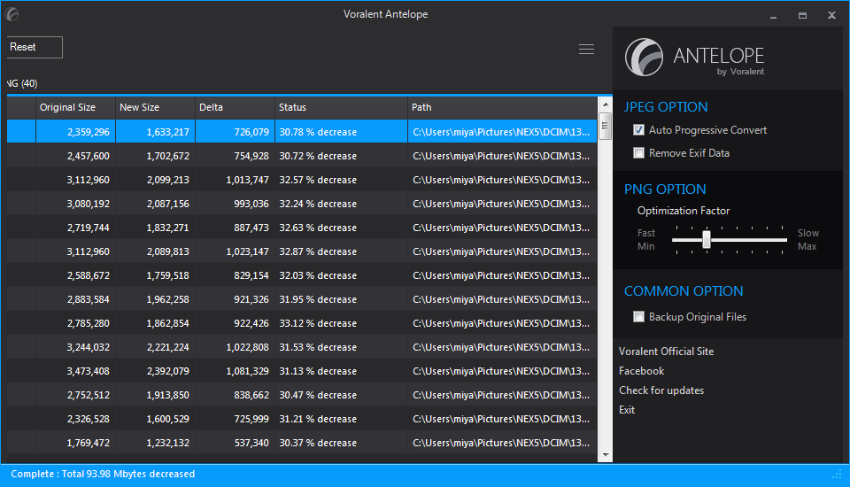
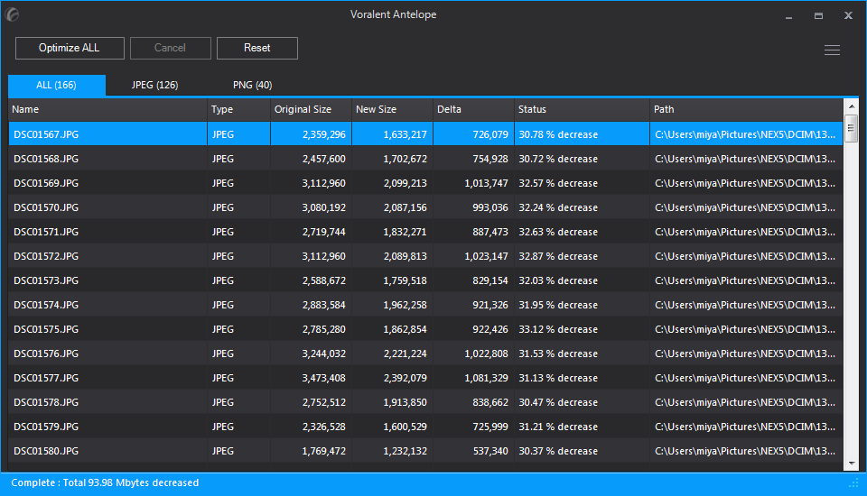
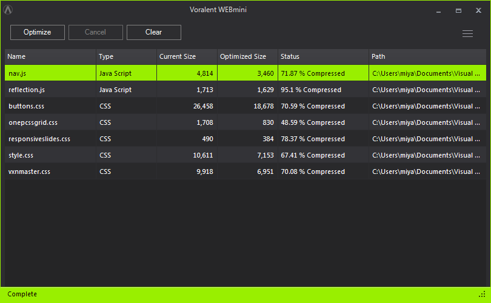

知道jpgmini和pngmini还是从虎哥的《[压缩博客图片文件](http://talk.synyan.net/2014/03/%e5%8e%8b%e7%bc%a9%e5%8d%9a%e5%ae%a2%e5%9b%be%e7%89%87%e6%96%87%e4%bb%b6/)》里看到的，还和虎哥热烈地讨论了如何把旧图搬到云上，当然我看见了之后马上就去百度了，结果找到了官网。（没想到是小日本的东西啊，不过好用的照用不误）

其实jpgmini和pngmini无非就是无损压缩图片的工具，但它胜在够小巧也很便捷，体积只有1M左右，而且只要把图片拖入就能直接转换了。官网上写着最低支持win7，但我用的是xp发现依然能用，小日本的东西就是好用啊。需要注意的是工具会直接对原图进行覆盖，所以需要保留原图的同学就要记得勾选&ldquo;Backup Original Files&rdquo;了。

等我上了官网发现，在今年官网更新了这两个工具，把它们合并在一起了，并且改名叫&ldquo;antelope&rdquo;，当然体积还是非常小，所以还是进步了不少。

不单单压缩图片，voralent这个网还有压缩js和css的工具，叫做&ldquo;webmini&rdquo;，起名字的方法果然如出一辙啊；不过对于这工具我还是不敢用，毕竟源码这种东西要是出了一点差错都很麻烦，所以想想还是算了，本来代码这种东西就很小，不是非常必要。

但让我耳目一新的是一个叫做&ldquo;webPconv&rdquo;的工具，一开始不知道是什么，官网解释是&ldquo;WebP file format converter&rdquo;，于是随便塞了一张jpg进去转换，得到一个webP文件，google一下，原来webP是谷歌研发的最新的图片格式，其体积对比jpeg将会缩小很多，但是画质相差无几。这说明什么，说明未来网络也许会盛行这种图片格式，但占用的体积将会大大缩小，这无疑是对我们这种博客主的一种福音啊，原本大小的图床却拥有更多数量、画质无差的图片。

但是目前就我所看，webP图片的画质比Jpeg还是有点逊色，而且其还需要专门的js插件才能看到，所以暂时还是别想太多了，希望不久的将来wordpress也会支持这种格式吧。

当然voralent这个网还有其他不错的小工具，有兴趣的同学不妨上去看一看。

[http://www.voralent.com/](http://www.voralent.com/)