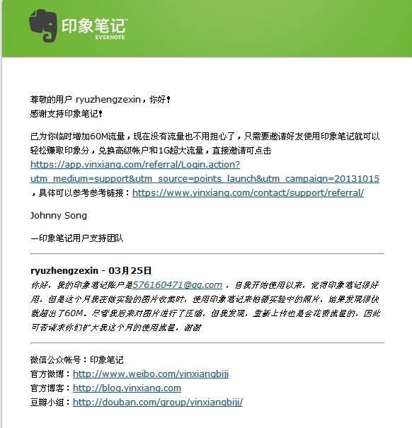
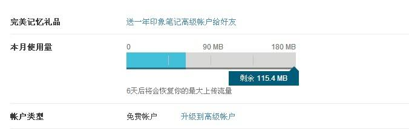

记载关于印象笔记的两件事，也许对于用大象的朋友会有帮助。

##一、流量不够用了

前些日子，因为总上实验课，于是就顺手用印象笔记把实验的图片都拍下来整理了，没想到的是，我是一个穷逼的免费用户，每个月只有60M的上传流量，而现在的手机拍照片，动辄都起码2M以上，所以一瞬间就发现这流量已经爆了。

真是可惜啊，其实印象笔记真的是挺好用的（自从我认真地学习了网上别人的经验后），没办法就上网去找有没有解决的方法，恰好让我看到百度经验有人说发邮件给客服就能得到暂时的增加流量。

于是就死马当活马治，发了封邮件过去&mdash;&mdash;

嘿，没想到还真管用！于是我赶紧上网页版一看，MMD，居然不止送多我60M，而是整整120M。

##二、连接不到服务器

对于使用windows客户端的朋友来说，连接不到服务器是经常遇到的事情，而我自己也摸索出一门套路来对付。首先你得是印象笔记国内的用户，而不是国际版的用户，因为国外的服务器连接不上的话，我也没有什么好方法。

对于国内版的大象，连接不到服务器，有9成都是IE在作怪，所以首先，你要排查是不是IE出错了。

首先要做的就是打开IE，

*   看IE能不能上网；
*   如果IE能上网，那就打开CMD，输入`ping app.yinxiang.com -t`,如果ping不上，可以说明你的IP或者DNS有问题）；
*   如果不能上网，看看有没有勾选&ldquo;脱机&rdquo;选项（当然要取消脱机）；
*   如果IE还是不能上网，不用想了，找软件修复网络连接吧，网上有很多这样的软件；

其实是因为印象笔记是要靠IE来连接同步笔记的，所以如果IE连不到印象笔记的服务器，就肯定同步不了了，所以大家如果同步出问题，多点检查IE就可以解决了。

其实印象笔记是很不错的笔记软件，但如果大家觉得入门难或者同步出问题，我推荐国内的有道云笔记和为知笔记，这两款都很不错。