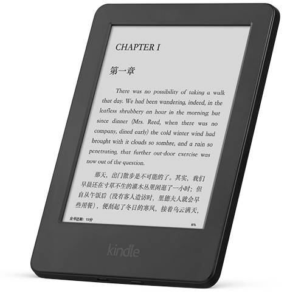
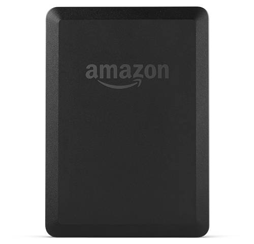
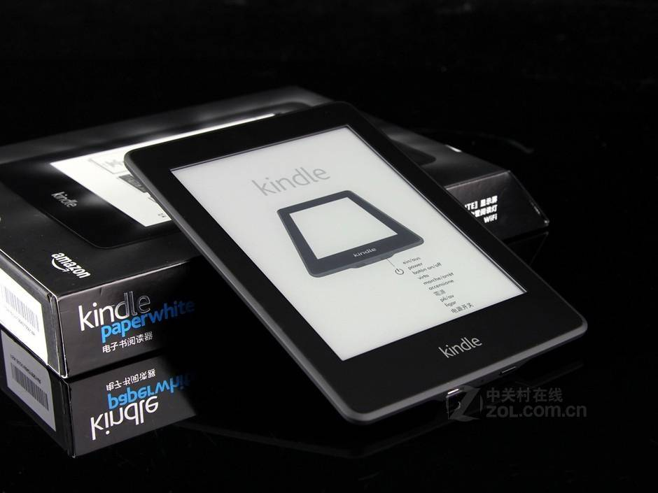
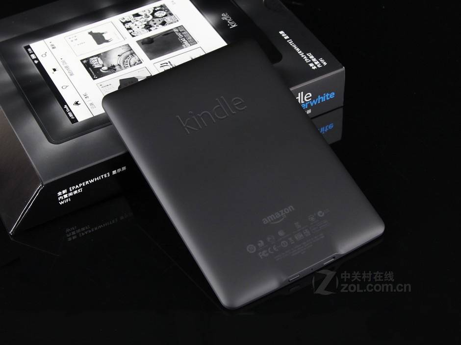
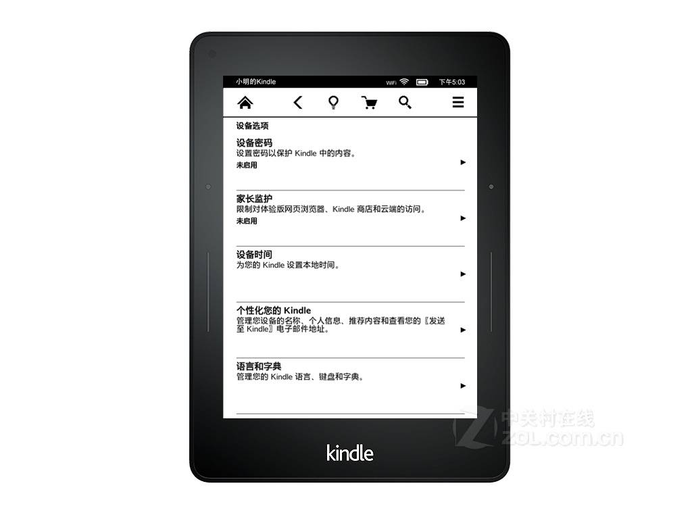
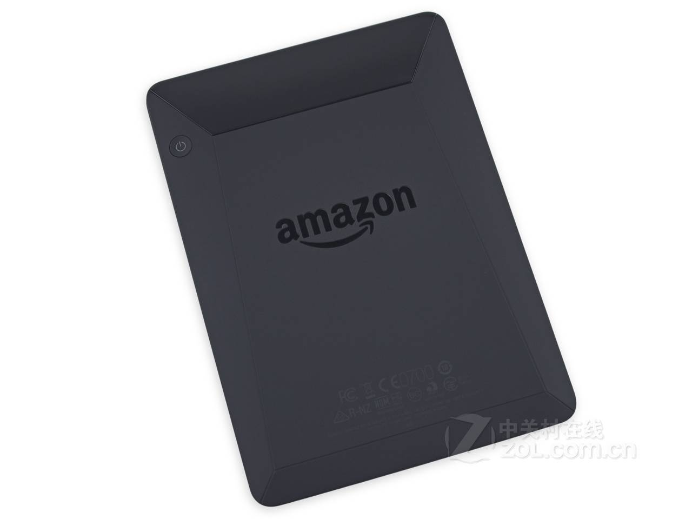
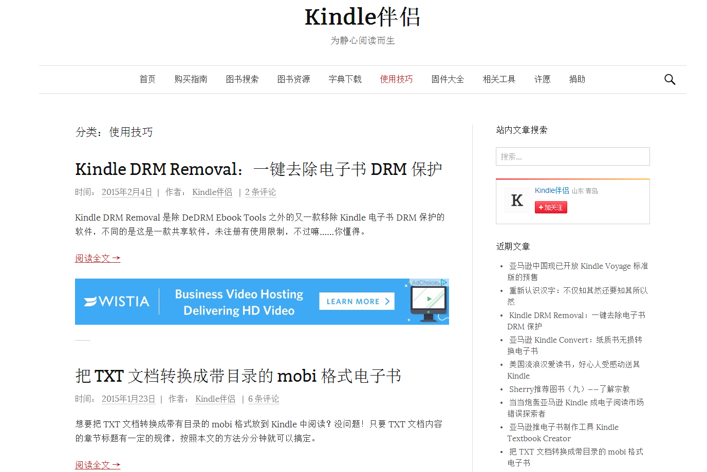
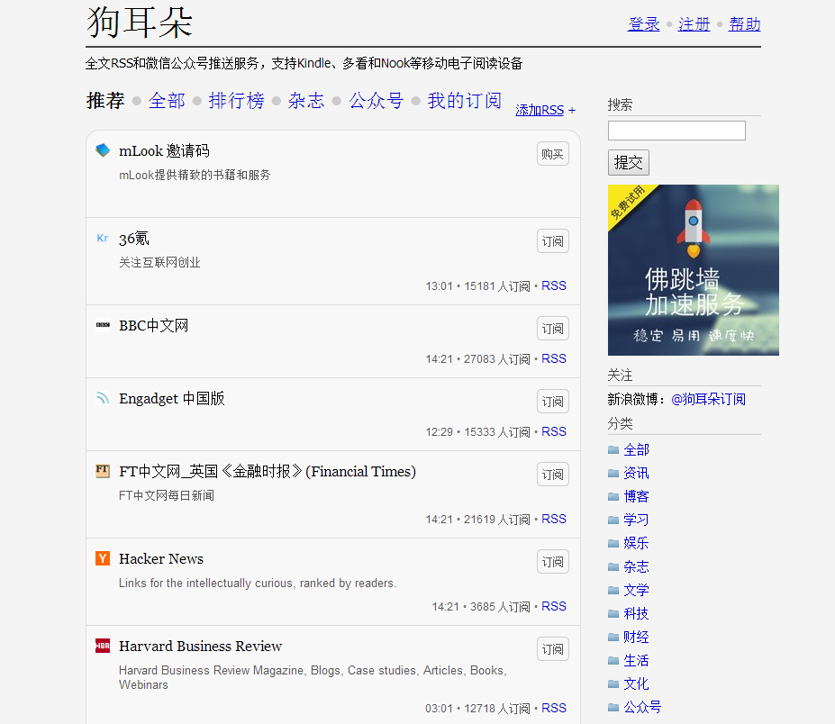
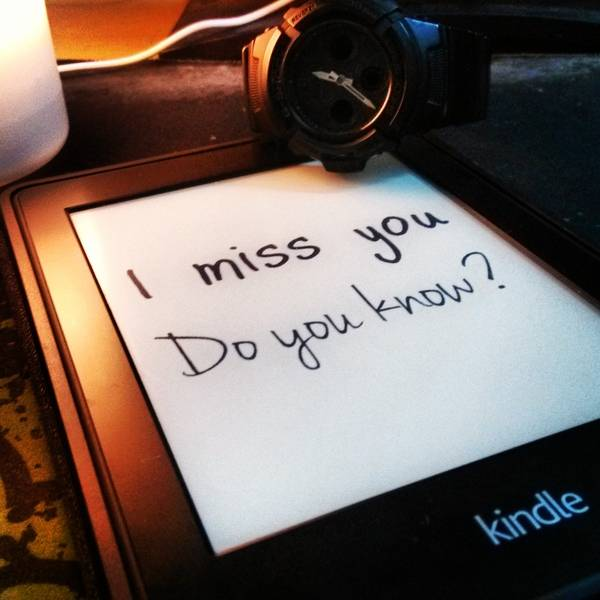
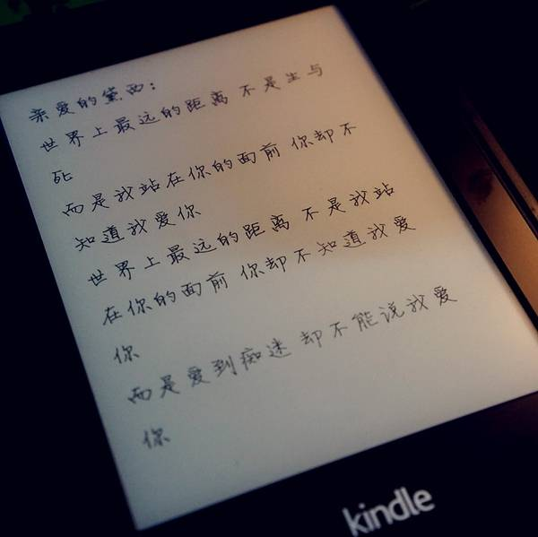

不知不觉我的Kindle也入手了个来月了，下面就给大家说说自己的小感受：

##Kindle的购买

其实，Kindle作为一个看书的设备真的很出色，但是很多人因为价格而犹豫，到底买不买？或者是买哪一款？

首先我要说，如果你不是一个中或重度读书患者的话，不要买！因为你买了也不用，事实上很快你就会转手卖出去；如果需要买来装B的话除外。

另外，亚马逊提供了好几款Kindle设备，要买的朋友可以按如下标准选择——

 - 如果你是真壕，不用问肯定是亚马逊Kindle Voyage了，1999的套餐，但是也是绝对超值的；
 - 如果你只是需要Kindle，而且也想晚上看书，经济条件不错，选择亚马逊Kindle Paperwhite，一代或者二代都可以，不过中亚现在只有一代，899，也不是很贵，最多人选择应该是这款；
 - 如果你像我一样是学生党，或者想要实惠一点，那就买现在的499New Kindle，除了没有背光灯，配置几乎是一样的（要注意的是499的不能刷成多看系统，不能换锁屏壁纸，其他就外形上有一点不同而已）
 - 如果你要看PDF，推荐你最好不要买Kindle，买亚马逊的Fire平板或者其他什么都好，真的不能看，6英寸的屏幕完全在虐待自己（我似乎说过看书中重度患者的话，大部分书能买到中亚正版或者网上有资源）

给出官网给的参数对比

<table><thead><tr><th style='text-align:center;' ></th><th style='text-align:center;' >Kindle</th><th style='text-align:center;' >Kindle Paperwhite</th><th style='text-align:center;' >Kindle Voyage珍藏限量版</th></tr></thead><tbody><tr><td style='text-align:center;' >价格</td><td style='text-align:center;' >¥499</td><td style='text-align:center;' >¥899</td><td style='text-align:center;' >¥1,999</td></tr><tr><td style='text-align:center;' >屏幕尺寸</td><td style='text-align:center;' >6英寸</td><td style='text-align:center;' >6英寸</td><td style='text-align:center;' >6英寸</td></tr><tr><td style='text-align:center;' >防反光屏幕</td><td style='text-align:center;' >有</td><td style='text-align:center;' >有</td><td style='text-align:center;' >有</td></tr><tr><td style='text-align:center;' >内置阅读灯</td><td style='text-align:center;' >无</td><td style='text-align:center;' >有</td><td style='text-align:center;' >有，智能调光</td></tr><tr><td style='text-align:center;' >分辨率</td><td style='text-align:center;' >167 ppi</td><td style='text-align:center;' >212 ppi</td><td style='text-align:center;' >300 ppi</td></tr><tr><td style='text-align:center;' >WiFi</td><td style='text-align:center;' >内置</td><td style='text-align:center;' >内置</td><td style='text-align:center;' >内置</td></tr><tr><td style='text-align:center;' >电池续航</td><td style='text-align:center;' >一次充电支持数周，非数天</td><td style='text-align:center;' >一次充电支持数周，非数天</td><td style='text-align:center;' >一次充电支持数周，非数天</td></tr><tr><td style='text-align:center;' >存储容量</td><td style='text-align:center;' >4GB（用户可用内存 约3GB）存储数千本电子书</td><td style='text-align:center;' >4GB（用户可用内存 约3.2GB）存储数千本电子书</td><td style='text-align:center;' >4GB（用户可用内存 约3GB）存储数千本电子书</td></tr><tr><td style='text-align:center;' >重量</td><td style='text-align:center;' >190克</td><td style='text-align:center;' >209克</td><td style='text-align:center;' >180克</td></tr><tr><td style='text-align:center;' >设备尺寸</td><td style='text-align:center;' >169毫米 X 119.2毫米 X 10.15毫米</td><td style='text-align:center;' >169毫米 X 117毫米 X 9.1毫米</td><td style='text-align:center;' >162毫米 X 115毫米 X 7.6毫米</td></tr></tbody></table>

给出Kindle三款的前后面板对比

**499 New Kindle**

[photos]

[/photos]

**899 Kindle Paperwhite**（注意Kindle字样变成白色，背部有突起）

[photos]

[/photos]

**1999 Kindle Voyage**（注意正面有感应条，背部为斜面）

[photos]

[/photos]

关于Kindle的购买与选择就说到这里，如果大家还有什么不懂的，推荐看王自如的视频

<iframe height=400 width=800 src='http://player.youku.com/embed/XODY0MzY2MTAw' frameborder=0 'allowfullscreen'></iframe>

##使用Kindle的小Tips
###好的网站
这里我推荐一个我自己经常泡的论坛——[Kindle人](http://kindleren.com/)以及[Kindle伴侣](http://kindlefere.com/)，这里分享了很多关于Kindle的知识以及资源。

###用Kindle订阅新闻以及Rss
有很多同学其实很喜欢阅读新闻还有订阅自己喜欢的网站，这里我推荐一个[**狗耳朵**](http://www.dogear.cn/)，它是免费的，缺点就是你要每60天登录一次，不然你的订阅会被取消；另外推送里面的图片也要购买VIP才能支持；但是优点也是明显的，我就用来订阅ONE以及喷嚏图卦，这两个是免费支持图片的，每天只要定时就会发送过来，忘记看了也能看回。还支持将文章发到印象笔记、为知笔记、Pocket等等，实在是太方便了。

###用微信给Kindle推送书籍
这个是很多同学都关心的问题，如果你想看什么书，然后打开微信公众号，输入书名，推送，10分钟内就能到达你的Kindle，这是多么方便的一件事情，我用的公众号是Kindle10000，也是免费的，维护团队都很负责，推荐大家关注。

##用Kindle装逼
如何用kindle来给我们提高逼格，讨得妹纸的欢心，大家可以看看知乎上的这个问题[问题](http://www.zhihu.com/question/20898821)，就可以学会以下两个super zhuang B 的技巧了！
###用Kindle写情书

[photos]

[/photos]

###用Kindle写一手好字

