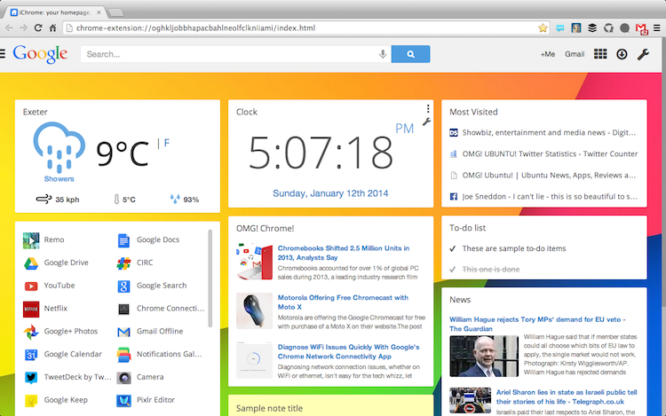
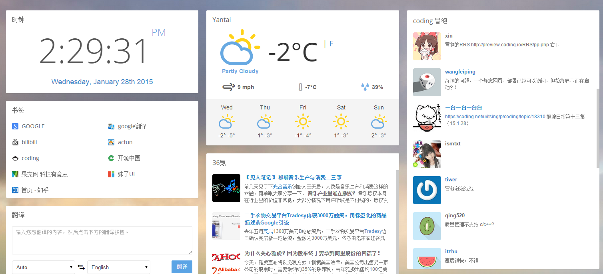
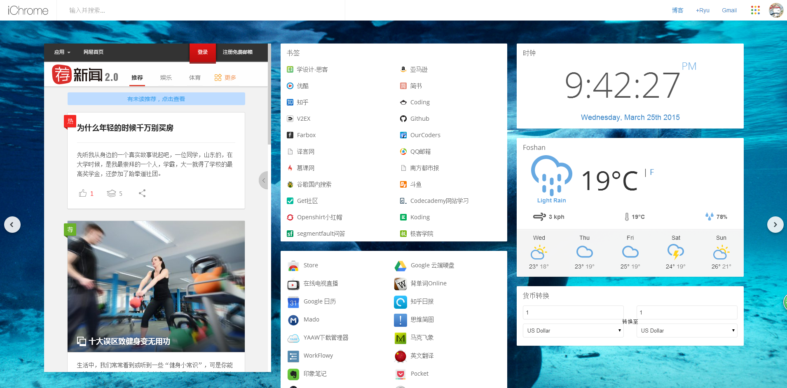
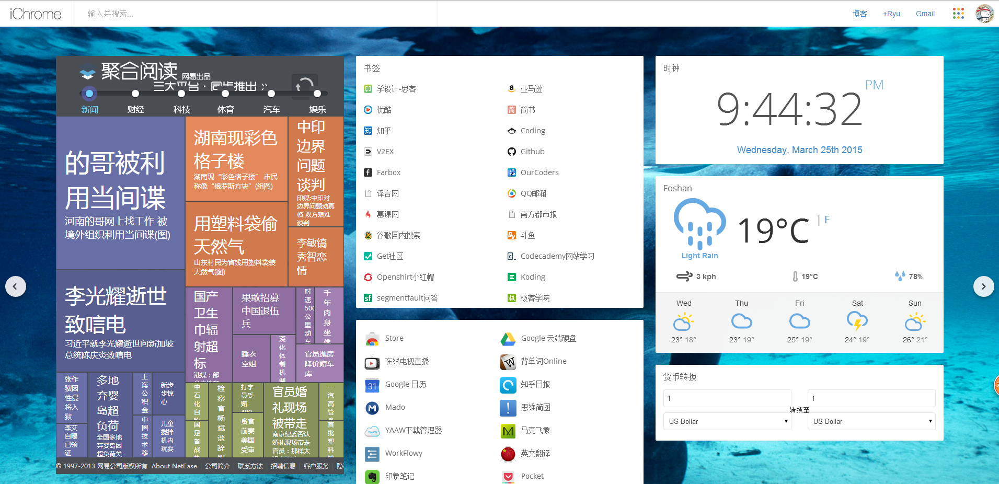
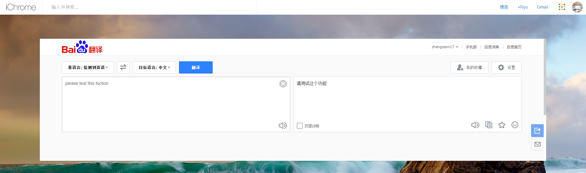

好久没有更新博客了，发现自己的语言表达能力又降低了，这个星期很开心的迎来了博客点击量破万，想想这也算是我个人的一个小小的进步。

相信不少用Chrome的小伙伴们都会使用标签页插件，比如微度、Infinity new tab等等，而iChrome也算是个中翘楚，正是因为它的丰富的小部件功能，可以起到很多方便的作用，比如天气、待办事项、新闻、邮件乃至于股票。这里我就不废话这个插件的功能，而是给大家说一些小用法。

##用Rss小部件订阅内容
比如，你可以使用Rss订阅小部件添加你喜欢的博客，甚至是coding的冒泡（这个冒泡由Coding的[xin](https://coding.net/u/xin/)教的）。

具体做法就是添加“Rss订阅小部件”，然后在进入小部件设置里面，填上Feed链接——[http://preview.coding.io/RRS/pp.php](http://preview.coding.io/RRS/pp.php)。当然，订阅其他内容也是如法炮制。

##使用iframe的神奇功能
不得不说，iframe是一个神奇的功能，它可以内嵌一个网页，大家能想到这能做什么吗？几乎是什么都可以，比如
###嵌入新闻网站。###
这里有一个需要考虑的地方，iframe是直接嵌入网页的，并不会智能转换你的页面，所以有时候有些电脑网页的边框是很难看的，我推荐使用能手机的网页。比如新闻网页我推荐“**荐新闻**”（网址是[http://j.news.163.com](http://j.news.163.com)）

以及“**网易聚合**”（网址是[http://tag.163.com](http://tag.163.com)）

看上去是不是觉得Chrome的标签页丰富多了。

###嵌入翻译小窗口###
嵌入百度翻译的小窗口，加快翻译的方便性

<iframe src="http://fanyi.baidu.com"  height="500" width="100%"></iframe>

我觉得，几乎是只要你想到，就没有iframe做不到的；当然，iframe也有其缺点，也并不是万能的，比如说我尝试嵌入一个邮箱的小窗口，却发现邮箱一般都是加密的，iframe是无法做到很好的嵌入的。

如果你还想到嵌入什么好玩的窗口，欢迎你留言。