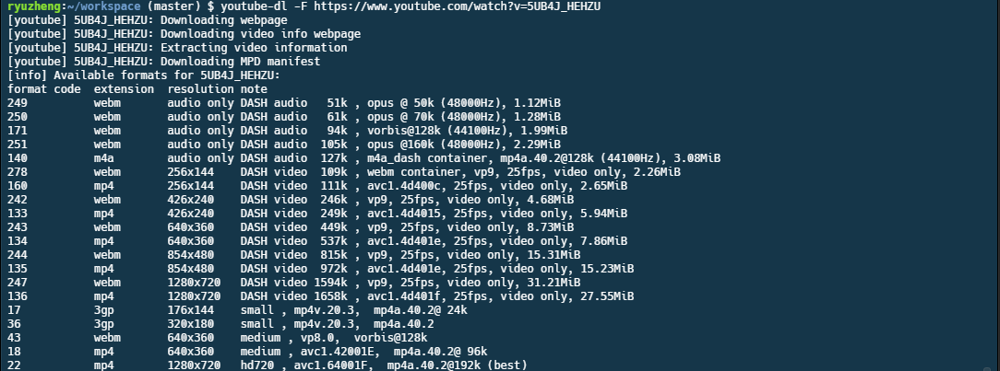
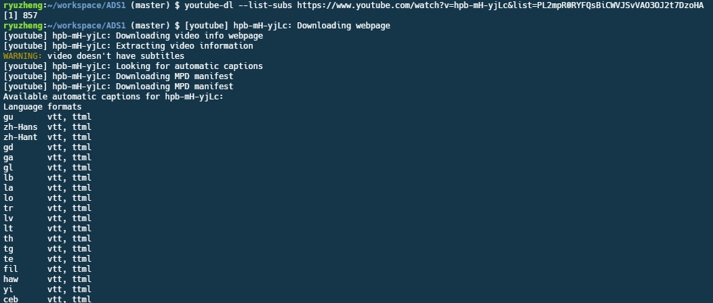

最近在上油管看各类视频，因为有些视频不错，而网络条件又不是每时每刻都那么好。所以就想趁着在网络好的地方，先离线好油管的视频，那走到哪还是能接着看啦。

说干就干，立马就Google，虽然找到类似`4K Video Downloader`这种比较傻瓜式的软件，但是不知为啥，使用` proxifier`设置它走代理还是下载不动；有的人说，直接用`IDM`下载就可以啦，但是我的`IDM`设置代理不知道为啥也不成功，无奈之下，只好找其他方法了；又尝试过直接使用网上那些转换油管视频的网站，例如[clipconverter](http://www.clipconverter.cc)，网站本身是十分好的，奈何直接在浏览器下载速度还是太慢了。

虽然尝试了那么多都失败了，但是技术改变生活，幸好我尝试了`Youtube-dl`，本来以为`Youtube-dl`很难布置，但是看到了知乎上的一个回答[《如何下载Youtube的视频》](http://zhihu.com/question/22247271/answer/41909651)，发现十分简单。于是就自己尝试了一下，请注意，以下布置是于2016年9月17日尝试成功的，**前提是你有一个能上youtube的网络环境，以及Ubuntu操作环境**，如果是Windows，请自行Google在win下的布置方法。

## 布置ffmpeg + youtube-dl##

首先，启动你的Ubuntu系统，或者你可以在你的VPS上操作：
首先安装ffmpeg，打开终端：

```bash
sudo apt-get install python-software-properties software-properties-common
sudo apt-add-repository ppa:mc3man/trusty-media
sudo apt-get update
sudo apt-get install ffmpeg gstreamer0.10-ffmpeg
```

然后安装youtube-dl：

```bash
sudo curl -L https://yt-dl.org/downloads/latest/youtube-dl -o /usr/local/bin/youtube-dl
sudo chmod a+rx /usr/local/bin/youtube-dl
```

这样子就布置成功了，然后是抓取视频：

```bash
youtube-dl -F https://www.youtube.com/watch?v=5UB4J_HEHZU #可以是视频链接或者是播放列表链接
```

返回类似这样的结果，其实是该视频的每种格式的详细情况——



第一列是格式的代号，第二列是文件格式，第三列是音频和视频分辨率等，第四列是视频/音频编码格式及文件大小等详情。

然后我们使用`youtube-dl -f`下载选中的格式的代号，例如

```bash
youtube-dl -f 22 https://www.youtube.com/watch?v=5UB4J_HEHZU #要下载播放列表也是同样，会自动下载列表中所有视频
```

## 下载油管字幕##

`youtube-dl`是有字幕选项的，但是博主没有认真去研究过，也许以后有时间，再写一篇详细的youtube-dl的blog，但是有一个网站用来下载油管的字幕还是很方便的，就是[downsub](http://downsub.com/)了，直接输入视频链接，然后选择下载的语言。

-----
2016.11.20更新
油管下载字幕也非常简单

```bash
$ youtube-dl -h
... #直接跳到字幕部分
Subtitle Options:
    --write-sub                      Write subtitle file
    --write-auto-sub                 Write automatically generated subtitle file (YouTube only)
    --all-subs                       Download all the available subtitles of the video
    --list-subs                      List all available subtitles for the video
    --sub-format FORMAT              Subtitle format, accepts formats preference, for example: "srt" or "ass/srt/best"
    --sub-lang LANGS                 Languages of the subtitles to download (optional) separated by commas, use --list-subs for available language tags
... #以下省略非字幕部分
```

可以看到，youtube-dl是支持字幕下载的，其中：

 - `write-sub` 下载up主自己上传的字幕（非youtube自动生成）
 - `write-auto-sub` 下载youtube自动生成的字幕
 - `all-subs` 下载所有字幕（有点夸张，可能用于采集吧）
 - `list-subs` 列出所有可以下载的字幕，包括语言以及格式
 - `sub-format FORMAT` 选择下载的字幕格式，如果没有你选定的格式，youtube会选择另外一个格式下载
 - `sub-lang LANGS` 选择下载字幕的语言

所以我们可以看见，本身youtube-dl的字幕下载功能就很强大。我演示一下`list-subs`以及如何下载一个播放列表并且包括所有视频的英文、中文简体字幕。

```bash
$ youtube-dl --list-subs https://www.youtube.com/watch?v=hpb-mH-yjLc&list=PL2mpR0RYFQsBiCWVJSvVAO3OJ2t7DzoHA
#列出所有可供下载的字幕，效果见下图
```


```bash
$ youtube-dl --write-auto-sub --sub-lang en,zh-Hans --convert-subtitles srt https://www.youtube.com/playlist?list=PL2mpR0RYFQsBiCWVJSvVAO3OJ2t7DzoHA
# 下载播放列表
```

## Reference##

- [《如何下载Youtube的视频》](http://zhihu.com/question/22247271/answer/41909651)
- [youtube-dl download page](http://rg3.github.io/youtube-dl/download.html)
- [youtube-dl](https://github.com/rg3/youtube-dl)