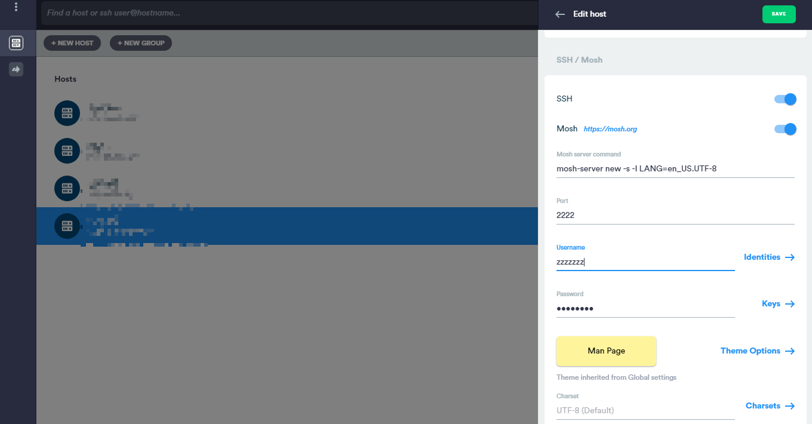
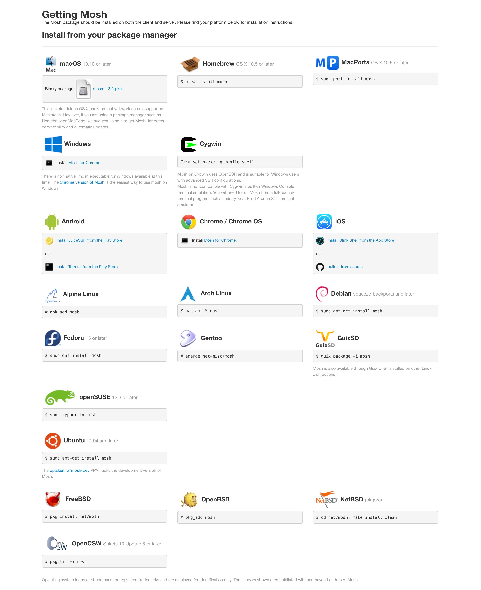

家里的网络有点差，之前买的VPS，直接连接SSH，输命令时有时卡卡的，于是就想到之前看到过的[`mosh`](https://mosh.org/)。引用维基百科的话来介绍一下`mosh`的特性。

> `mosh`不绑定使用者端的 IP address，这使得使用者从移动网络（像是 3G、4G）与 WiFi 之间切换时，不会造成连线中断。
> `mosh`保持连线开启，当此用者断线时，服务器端只会认定为暂时离线（sleep）让使用者可以稍候连回来。相对的，SSH 因为透过 TCP，在使用者断线时会造成连线中断。
> `mosh`会试着在本地端马上显示使用者所输入的按键，这使得使用者会感觉到更少的延迟。

## CentOS安装mosh

CentOS安装mosh比较简单，使用`yum install mosh`就可以。如果你提示错误，参考Reference里的文章，可能需要先添加源。

另外，如果你之前参考我的文章，服务器的防火墙关闭了多余的端口，那么这时候就要手动打开端口。

因为`mosh`默认是走UDP协议的，然后默认使用的端口是`60000-61000`，第一个连接时用的是60000，第二个连接使用的就是60001，以此类推。当然，你也可以手动指定。

```bash
firewall-cmd --zone=public --add-port=60000/udp --permanent # firewall添加你选择的ssh端口，--permanent是保存设置，否则下次重启后不生效
systemctl start firewalld # 若firewall未启动，则先启动
firewall-cmd --reload # 重新加载firewall
firewall-cmd --zone=public --query-port=60000/udp # 查看端口是否添加成功，yes表示成功，no表示未添加成功
```

使用管理员权限执行上面的命令，打开防火墙的端口就可以了，不要相信网上某些文章，将整个防火墙都关掉那种，简直饮鸩止渴。

## Mac使用mosh连接服务器

macOS默认是没有安装mosh的，类似于ssh，我们需要mosh连接，要首先安装好mosh，在mac下直接用brew安装。

```bash
brew update # 可以不更新
brew install mosh
```

如果没有修改过服务器的ssh端口，直接以下命令就可以连接；如果参考我的文章，修改过服务器的ssh默认端口的，参考第二条命令来连接；如果你连防火墙的udp端口也修改了，那么参考第三条命令，指定mosh走的udp端口。

```bash
mosh username@server_ip # 默认情况下的命令
mosh username@server_ip --ssh="ssh -p 245" # 修改ssh端口为你设置的端口
mosh username@server_ip -P 60011 # -P 指定mosh走的udp端口，如果你只打开了某个udp端口的话
```

## Win使用mosh连接服务器



Win下我习惯使用[Termius]()来登录mosh连接，当然如果你有其他终端软件也可以，如图将mosh的开关打开，然后填入你自己定义的SSH端口，如2222；填入用户名和密码，保存即可。

## 后言

mosh有其优点，比如对ssh支持很好，安全性也很好；但是也有一些缺点，比如只能刷新一个屏幕，如果你的运行结果超出一个屏幕，无法滚动看回，只能用`less`来捕获来看了。

另外，我查看mosh的官网，发现mosh在很多不同的平台，都有支持，所以真的很优秀。



## Reference

 - [ssh卡顿还经常掉线？试下mosh吧！ - 掘金](https://juejin.im/post/5d654f716fb9a06acf2b6af0)
 - [centos7安装mosh - 简书](https://www.jianshu.com/p/8e9940ac64d4)