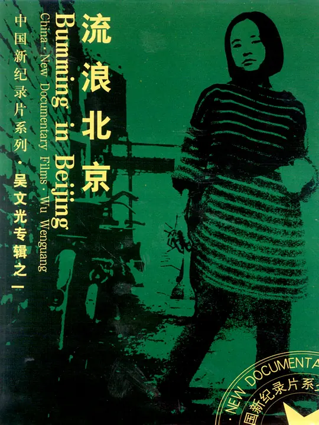

《流浪北京》 吴文光 [^1]

[吴文光](http://v.163.com/special/00853NT7/wwg.html)

接触到这部片子，是因为一天晚上上选修课《纪录片赏析》，正好说到这个“中国第一部纪录片”，要是真的有兴趣的朋友，不妨看一下，看看20多年前的北漂、盲流是怎么生存的。

这是一部1990年的影片，可以说用的手法在当时是十分创新的，老师说使用了剪辑材料，让多个人回答同一个问题，而使多时空的人形成类似对话形式的手法。

实话实说，我并不是很赞同里面的那些人追求梦想的方式，但是这是一部很特别的影片，虽然气氛有点沉闷，但是还是推荐大家看看吧。

有人说，《流浪北京》之于中国纪录片，就是崔健之于中国摇滚。

&lt;---9月23日更新---&gt;

《流浪北京》有续集名为《四海为家》[^2]，时间是在《流浪北京》三年后，新的出发。

[^1]: [流浪北京 (1990)](https://movie.douban.com/subject/1461188/)
[^2]: [四海为家 (1995)](http://movie.douban.com/subject/1962949/)