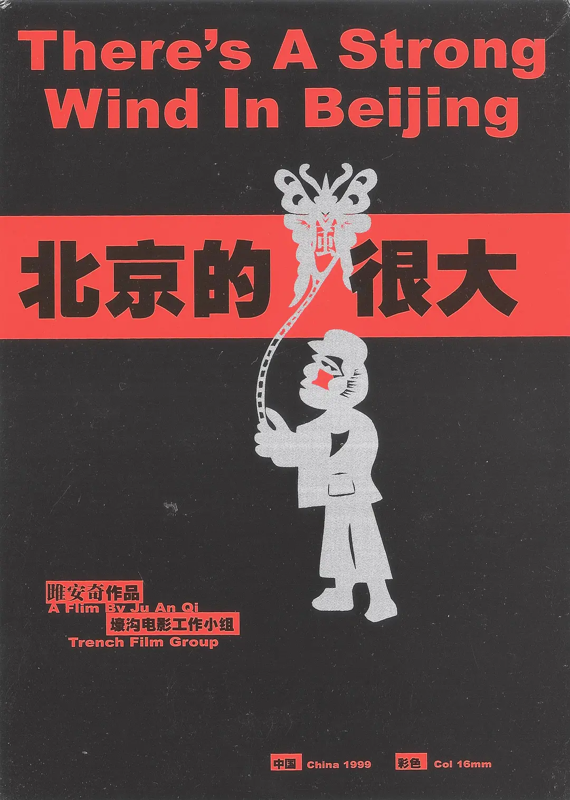

《北京的风很大》雎安奇[^1]

[雎安奇](http://movie.douban.com/celebrity/1327874/)

同样是一节纪录片赏析课，这次也是看看最早的那些中国纪录片，看的就是《北京的风很大》，老师说这是一部比较奇迹的电影，耗片比是1:1，为什么呢？因为这是一个比较传奇的故事，雎安奇用的是已经过期的胶片，本来胶片就少，就更不能浪费了，这在影片最后我们也可以看到。

其次这部片子用了一种暴力的手法，突然地闯进了各色人的生活中。也许吧，“暴力”是专业人的术语，在我看来，其实这是摄影者放得开来的表现，只有摄影者放开了所有一切，拍出的东西才是真实的，更加前所未见的。这正是这一部片做的好的地方。

最后，这个影片的结局也很特殊，非常之好！请各位有兴趣的话还是自己去看看这部影片，因为没有前面的那些丰富的材料，最后的这么一个结局不会这么有力，全片只有50分钟而已，全程也只有两个人在拍摄，这就是这部片子。

看一看吧，去看看那个结局。

[^1]: [北京的风很大 (1999)](http://movie.douban.com/subject/1421366/)