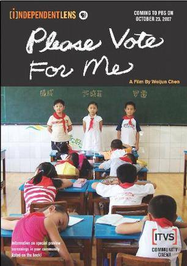

很可惜，这个星期为了复习生化的期中考试，所以逃了课没有听《纪录片赏析》，但是同学告诉我，这节课看的是《请投我一票》[^1]。

啊！这是一个多么有名的纪录片。值得注意的是，这部片子的发行商都是外国的，因此这部片子没有中文字幕，看上去还是有点累。也许是因为这部片子的题材吧，所以没能在中国发行？所以才能奥斯卡提名？

湖北武汉常青第一小学，三年一班的班主任为了让学生们理解民主的含义，于是在班中组织了一次班长的民主选举活动。候选者总共有三人：成成，一个胖乎乎的小男孩，颇有心计的他在这次选举中不遗余力，志在必得；罗雷，作为这个班的前任班长，他有着根深蒂固的威信和指挥力；许晓菲，三个候选人中唯一的女孩，乖乖女甚至爱哭鼻子，似乎是最没有竞争力的候选人。三个孩子围绕班长的职位展开竞争，在这一过程中同学和家长也不可避免地卷了进来&hellip;&hellip;&nbsp;

本片荣获2008年亚什兰独立电影节最佳纪录片奖、2008年芝加哥国际儿童电影节成人评委会金奖以及儿童评委会第二名。

找到一个带中文字幕的&mdash;&mdash;

<iframe height=400 width=700 src='http://player.youku.com/embed/XNDIzOTU5NzY=' frameborder=0 'allowfullscreen'></iframe>

[^1]: [请为我投票 Please Vote for Me (2007)](http://movie.douban.com/subject/2267155/)