5·17，因为党课的原因，去参观了位于越秀区恤孤院路的中共三大会址。恤孤院路是第二次来了，上次来时匆匆忙忙找团委，都没有好好观赏周围的风景，其实这地方真不错，位于以前的东山口，地名还这么特别——“恤孤院路”、“寺贝通津”。。。有一种西洋的风味，也有民国的气息。

<embed src="https://share.map.qq.com/share/panoId/10061055141212133809800/heading/194/pitch/0/zoom/1/pano.swf" quality="high" width="610" height="290" align="middle" allowNetworking="all" allowScriptAccess="always" allowFullScreen="true" mode="transparent" type="application/x-shockwave-flash"></embed>

三大会址早就没了，现在看到的不如说是三大遗址的纪念馆。可惜腾讯街景上没有馆内街景，其实这个纪念馆结构还是建的不错的，特别是那两条上二楼的楼梯，采用玻璃来采光，真的是白的漂亮，不同于其他博物馆。可惜我是去上党课的，不是旅游，当时没有拍很多的照片。

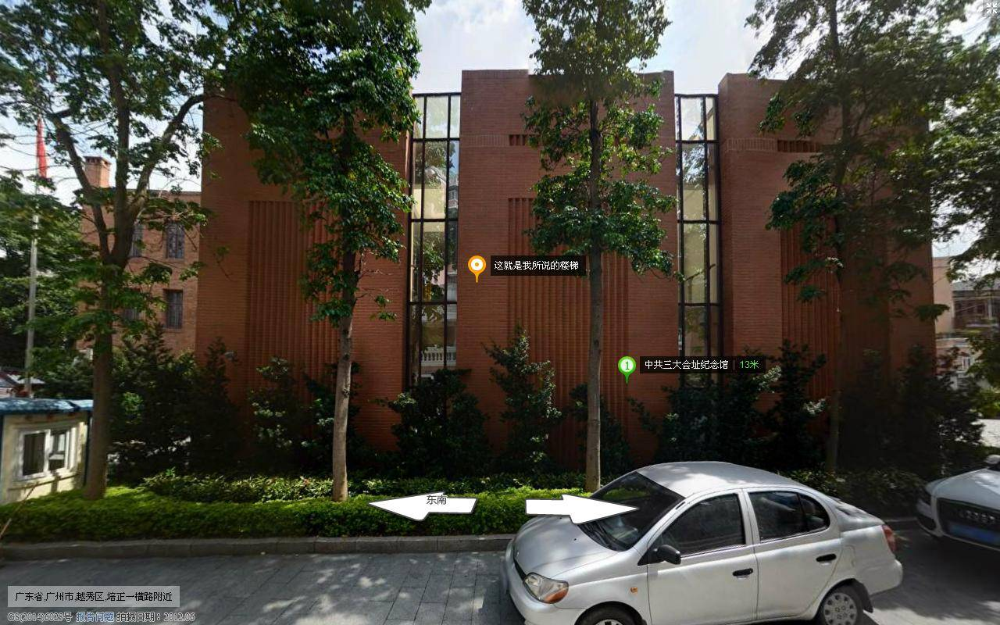

里面展出很多那时相关的文物，其中不乏伟人的手稿，当然，里面绝大部分都不是原件，原件另存在更好的博物馆，这有点遗憾。

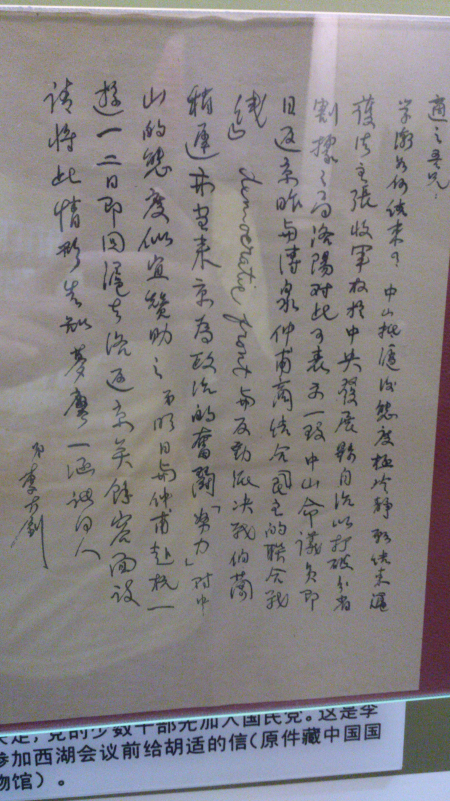

去过的人都会赞叹里面蜡像的真实程度，我们可以看到年轻时候的毛主席；当然蜡像归蜡像，我还是觉得旁边播出的黑白电影里的场景更符合当时开会的情景。

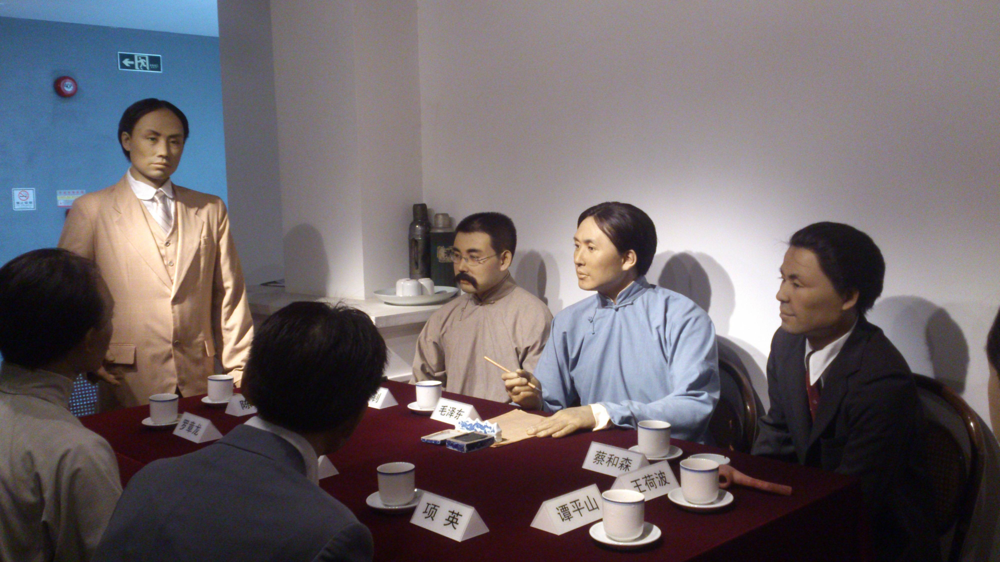

我说的中共三大会址其实是泛指附近一带的景区，包括当时开会地址的标记物“逵园”，还有中共领导的住宿楼“春园”等。

[photos]
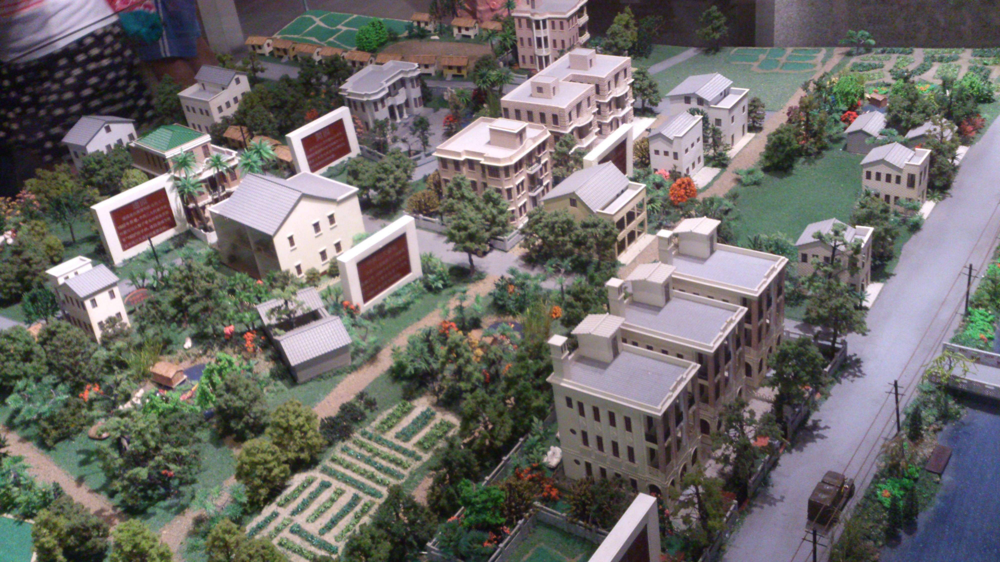

[/photos]

模型中唯一绿色房顶的就是逵园，逵园门上正中有书“1922”字样，正是当时开会地址的标志，不想能留存至今，都快100年了，真令人感叹，逵园正对面就是三大会址(已毁)，现在是一处平地，有个纪念碑，三大会址后面临近河边就是春园（这河如今仍在），春园有三栋楼，现在政府只收回了中间那栋，不过那栋正是主要领导人的住所，其余两栋，我参观时看到一栋荒废，都长出青苔来了；一栋做幼儿园，还是可以的，不知这些小朋友可知自己是在这么伟大的地方上学？

[photos]
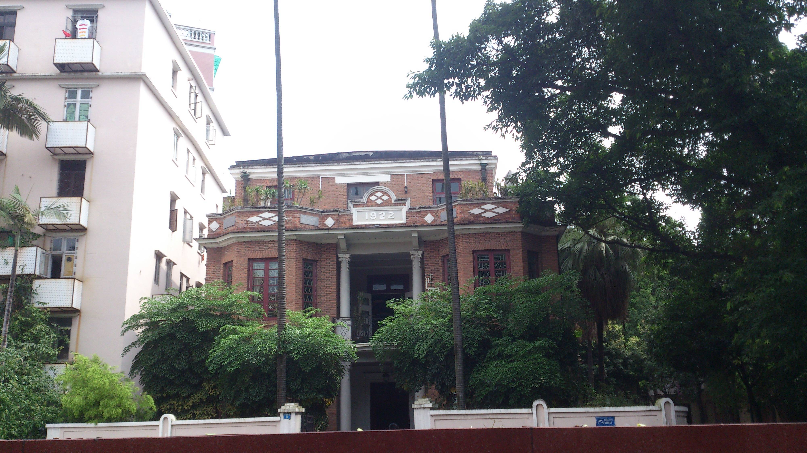
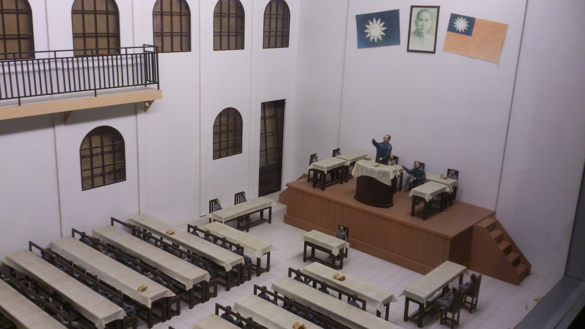
[/photos]

同时博物馆也有介绍国共第一次合作，最让我意外的是，博物馆里也有介绍6·23沙基惨案，因为我小时候就是在沙面和六二三路长大的，所以对于这个历史事件是很深刻的。不过博物馆里没有多少照片，这里上网找来了位于人民桥旁边的“沙基惨案纪念碑”，与君共勉，毋忘此日。

[photos]
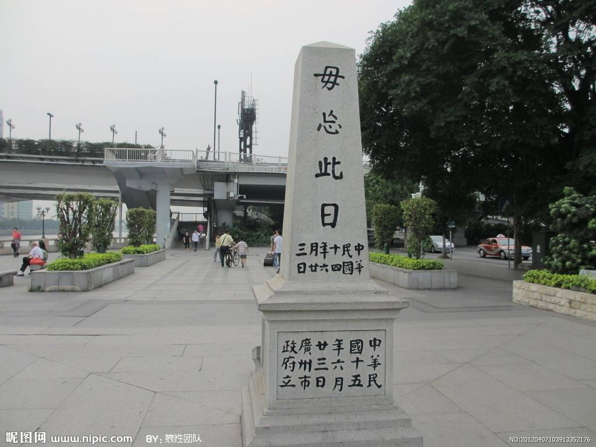

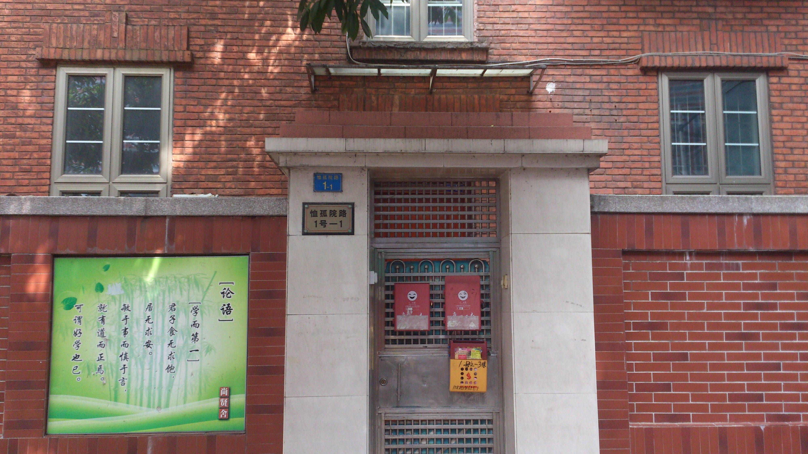
[/photos]

逵园现在变成了一个私人的艺术馆，周不时地展出一些摄影、画作，博主那天去正好有开，里面的摄影还是不错的哈哈（其实大部分看不懂），由于拍的是没有穿衣服的人体艺术，就不让人拍照了，博主还是乖乖地遵守了。

[photos]

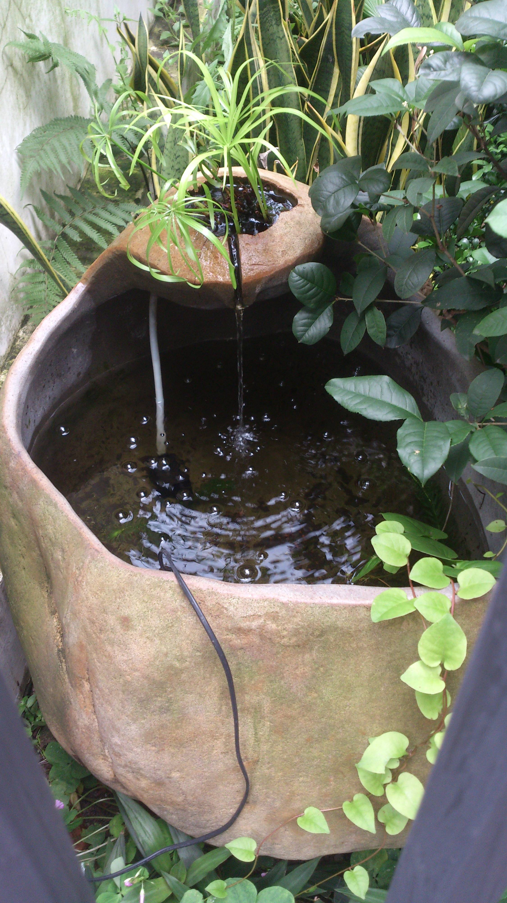

[/photos]

另一个值得提的地方就是东山古粤，东山古粤是一个青年旅舍，里面的环境真的很不错的，青年旅舍都是这么文艺的吗？好想说出发就出发，自己一个人去旅游啊！

<embed src="https://share.map.qq.com/share/panoId/10061004120617143124600/heading/197.3/pitch/12.8/zoom/1/pano.swf" quality="high" width="610" height="290" align="middle" allowNetworking="all" allowScriptAccess="always" allowFullScreen="true" mode="transparent" type="application/x-shockwave-flash"></embed>

还有那只白白的肥喵，好不怕生地卖萌。

[photos]
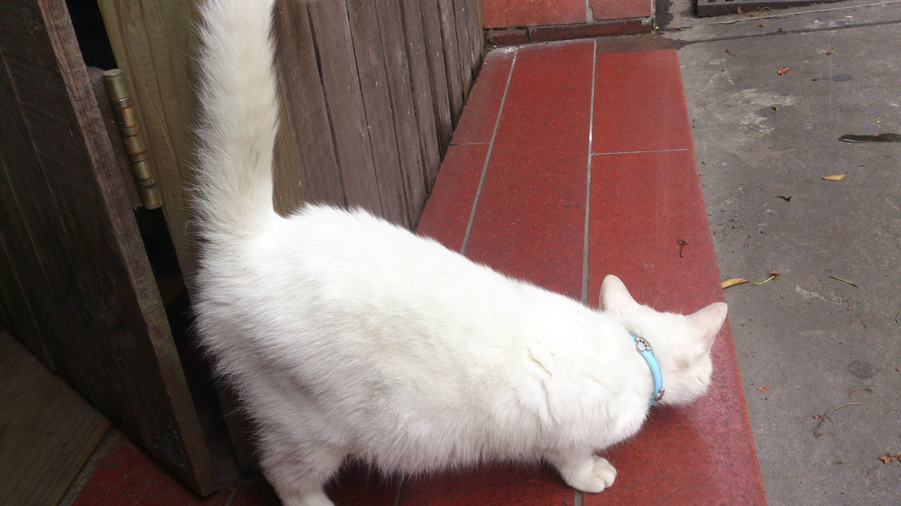
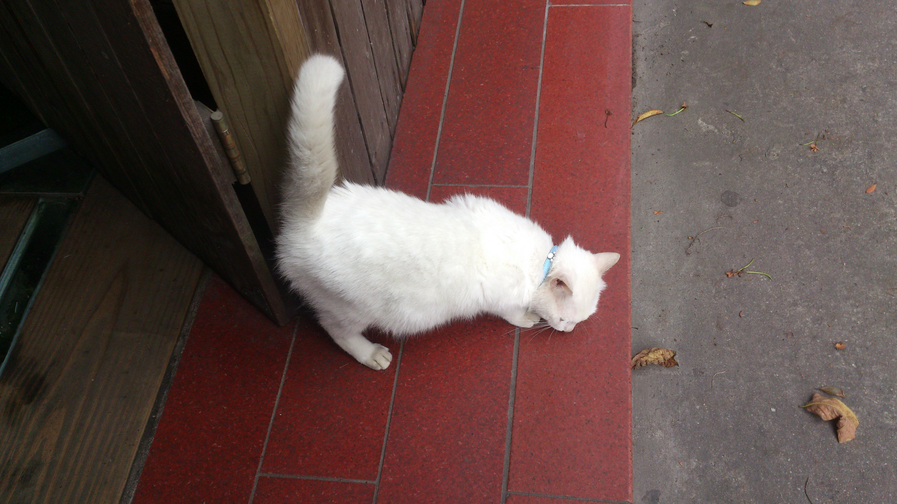
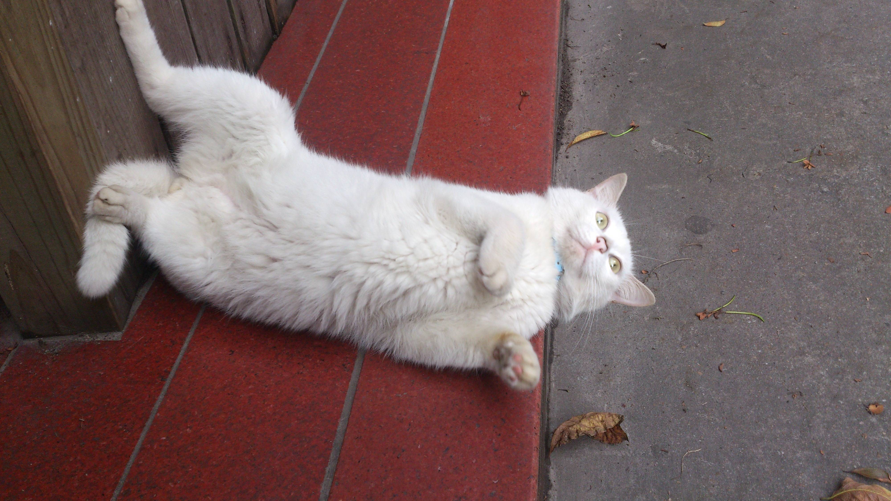
[/photos]

[photos]
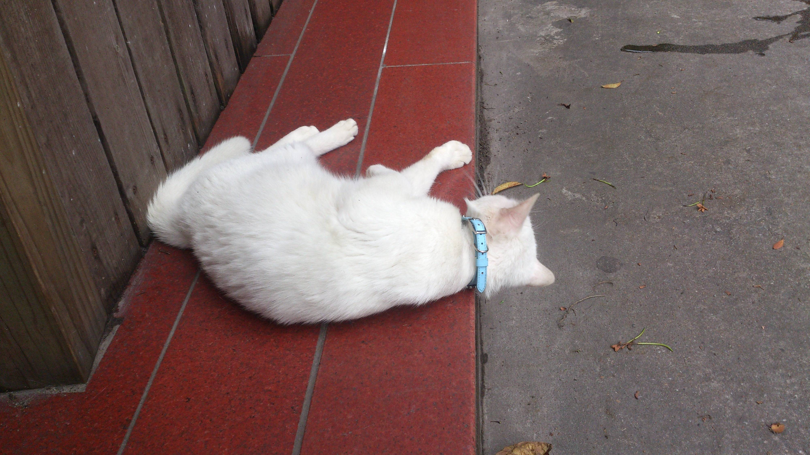
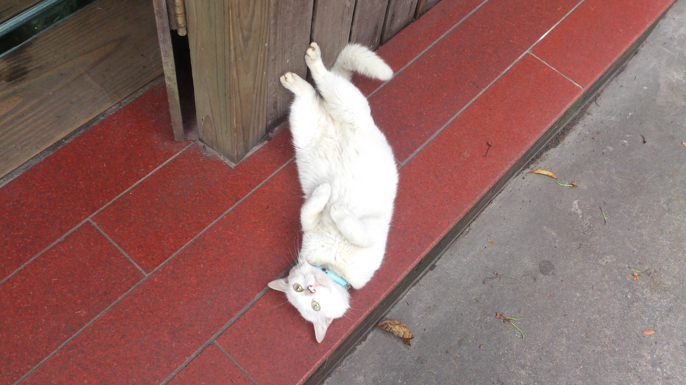

[/photos]

给诸位奉上肥喵的卖萌视频——

<iframe height=400 width=800 src='https://player.youku.com/embed/XNzE4NDQwOTY0' frameborder=0 'allowfullscreen'></iframe>

最后推荐大家去的地方是东山堂——

<embed src="https://share.map.qq.com/share/panoId/10061004120617124212200/heading/3/pitch/0/zoom/1/pano.swf" quality="high" width="610" height="290" align="middle" allowNetworking="all" allowScriptAccess="always" allowFullScreen="true" mode="transparent" type="application/x-shockwave-flash"></embed>

感觉有点凯尔特十字的感觉，那天进去听了一下演讲，里面的老人家待人很慈善，还主动找位置给我们，可惜我们就听了十分钟就走了。