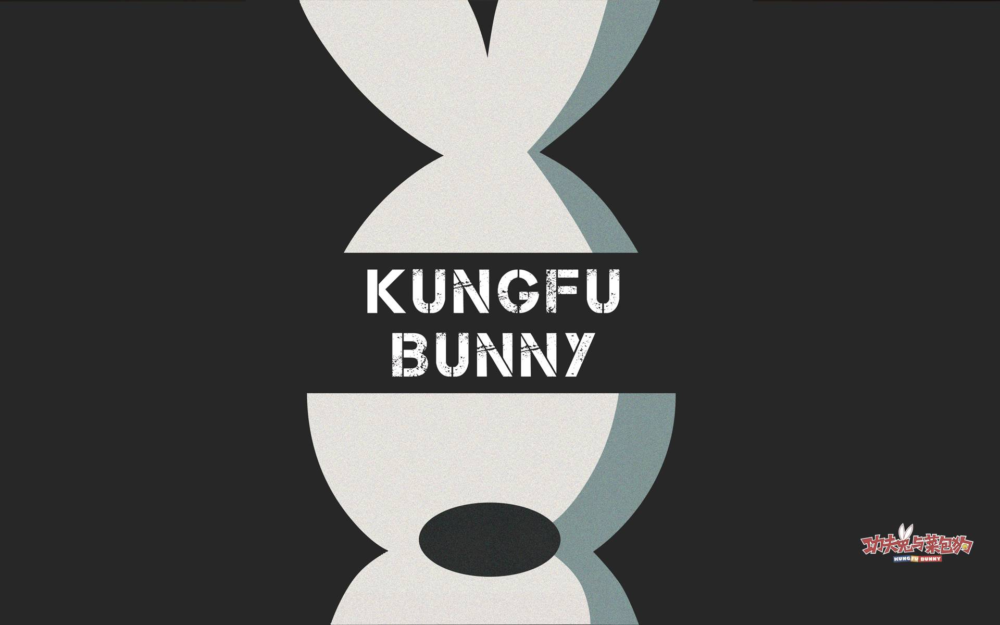
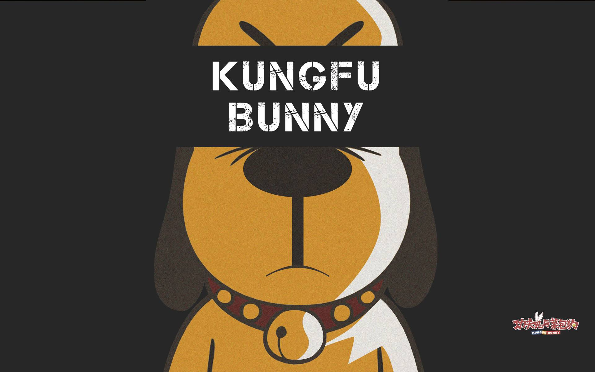

最近不知从哪得知一部国产的动画，叫做《功夫兔与菜包狗》，网上的好评如潮，于是自己也去找来看看，结果发现还真的不错，如果中国有多一点这样的动画作者就好了。

[photos]

[/photos]

以兔子为原型的动画并不少，就像《越狱兔》、《猫屎一号》，也非常不错；说它好，不只是这个动画形象画得好，首先功夫兔和菜包狗天生两种不同的性格，使他们形成像《猫和老鼠》里面的汤姆和杰瑞的关系，而作者在现实环境背景下加上漫画人物的这种设定让人觉得很新鲜。一个功夫兔和作者大人之间的交互，还有各种功夫打斗场面，确实好看（本来我就是一个功夫迷啊）；而菜包狗那种忠诚、胆小的性格，让我也好想有一只菜包狗来伺候我啊哈哈哈。

虽然菜包狗老是被冤枉，被欺负，但其实这部动画是我心目中排第二的治愈动画，在兔蛮蛮可能回不来、还有菜包狗脑子被电坏时，我确实有种为之伤心的感觉，而他们那种朋友间互相帮助的行为深深地治愈了我这颗平日里在社会里落寞的心。

一天看完下来，我真的一见钟情爱上了这只兔子和这只狗，现在我的输入法皮肤都换成了他们，哈哈！[输入法皮肤](http://jjjoystudios.com/taxonomies-other_genre/input-skins/)

感谢作者！只有拥有无尽想象力还有扎实画工的高手才能做出这部虽然看上去很幼稚，但是却非常深刻的动画！希望中国动漫界以后能涌现出更多这种这么好的动漫吧！

<iframe height=400 width=800 src='http://player.youku.com/embed/XNjg3NDgyNTI0' frameborder=0 'allowfullscreen'></iframe>

[功夫兔与菜包狗官网](http://jjjoystudios.com/)
[功夫兔系列动画](http://www.soku.com/search_video/q_%E5%8A%9F%E5%A4%AB%E5%85%94?f=1&kb=0412000000000__)