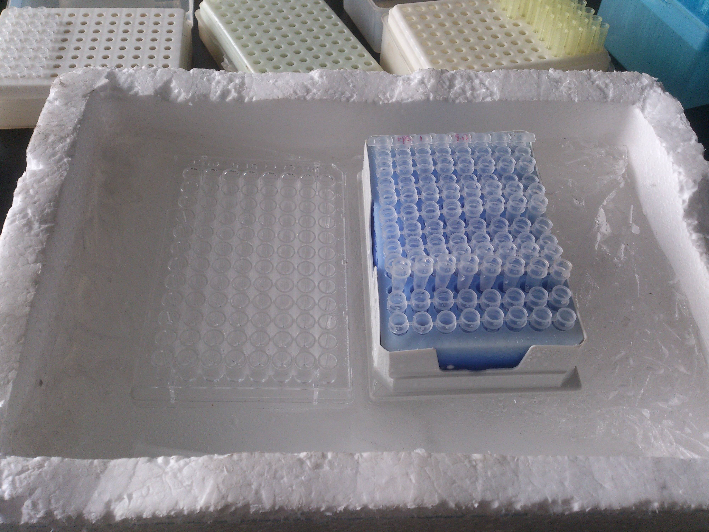
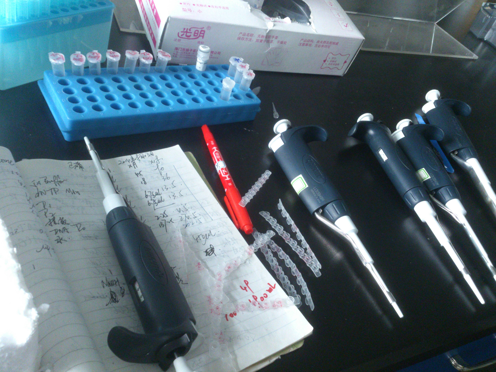

这几天是我们学校的新生报到日，不知不觉就来到了大三，很快就要走过大学这一段路程，真的不免感到有些悲伤。其实每年都有努力，希望自己变得更好，学习得更好来报答父母，但每一次都很失望。恰好今天有看到了这个泰国的广告（东南亚这些小国经常拍出令人感动的广告片），为父母的爱真的很感动，无论富或贫，他们总是想给孩子最好的一切。

<iframe height=400 width=800 src='http://player.youku.com/embed/XNzgwNTMyMTc2' frameborder=0 'allowfullscreen'></iframe>

今天新生报到，有人欢喜有人忧，欢喜的也许是新生，刚来到大学，什么都感到新鲜；忧愁的也许是大四，还有一年就毕业了，是工作还是考研，何去何从；有为新来的师妹感到开心的，有为即将到来的困难感到担心的。上一年我作为志愿者去迎接新生，送上宿舍，今年我决定去做实验，一个人在实验室里待了一个上午，有收获也有失望。

[photos]

[/photos]

不管怎么说，开学了，新的一年奋斗开始了！