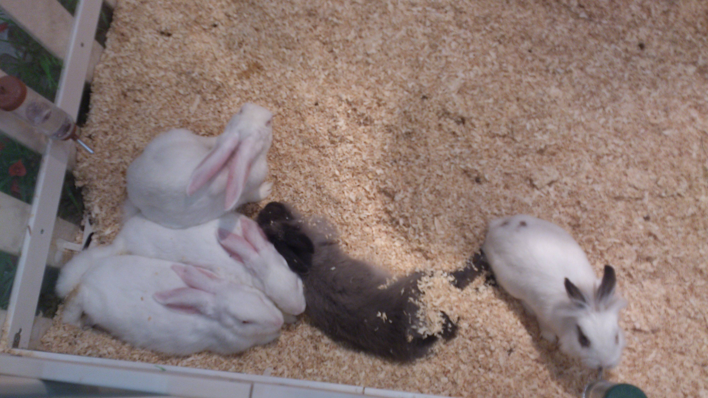
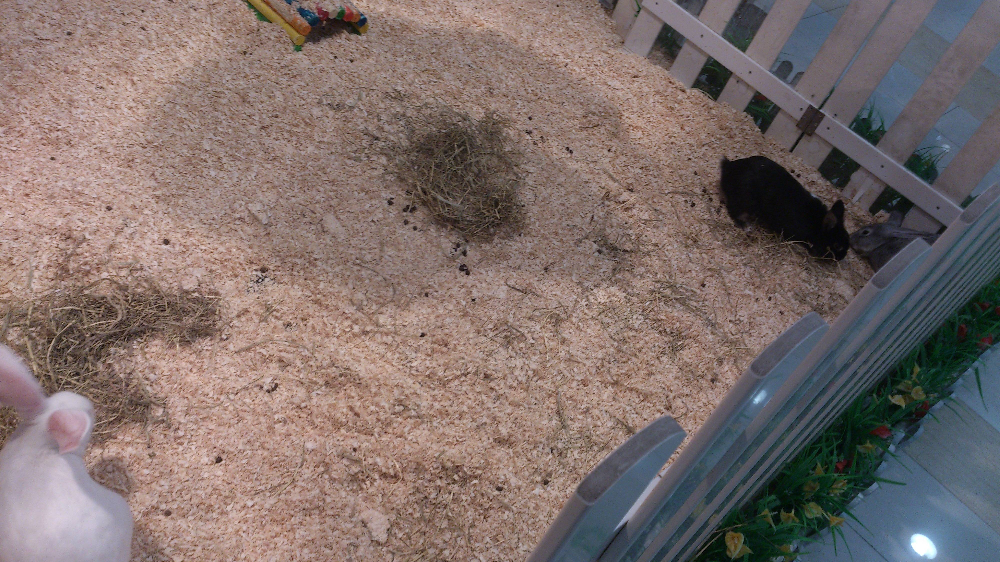

昨天路过西门口的富邦中心，看到里面居然有个兔乐园，然后又七八只兔子生活在里面，初时觉得在广州居然还有一个这样的广场，里面居然放着几只兔子。

<embed allowscriptaccess="never" height="290" quality="high" src="https://share.map.qq.com/share/panoId/10061004120702134539400/heading/231.18293088363842/pitch/-10.701482580985761/zoom/1/pano.swf" type="application/x-shockwave-flash" width="500" wmode="transparent"></embed>

然后我在那里呆了一会儿，正值午饭时间，看到一个女的把自己养的兔子&ldquo;白白&rdquo;放进去跟它们玩，还以为这些兔子都是来逛街的客户或者住在富邦的住户们的兔子；于是就问她，才知道原来这些兔子都是公司的，公司有一个助养兔计划，而她是带着自家养的兔子来上班，中午去吃饭时就放在兔乐园。

旁边有一个牌子写着&ldquo;助养兔计划&rdquo;，大意就是如果你捐助100元每个月，就能获得每个月用一簇提摩西草喂兔子，还能近距离地合影的机会。

不得不说，提出这个计划的人真的非常有商业头脑，既赚到钱又吸引了人来广场逛街。同时应该也是一个爱兔之人啊。