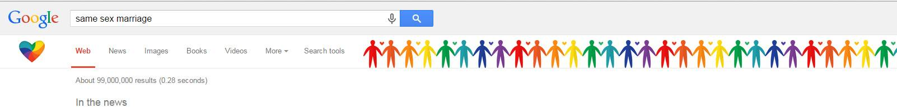
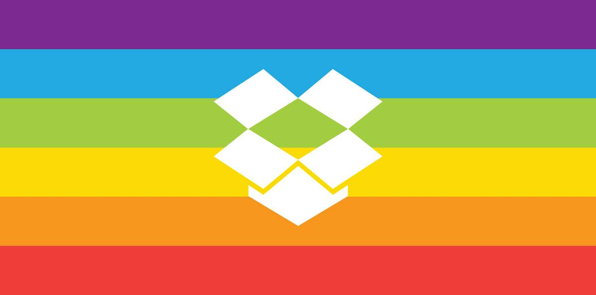

美国最高法院今早裁决宣布全美同性恋婚姻合法。在法院的公告书（PDF）中写道“最高法院在此做出裁定，认为同性恋双方可行使美国公民的基本权利进行结婚。”于是，好多美国的网站都疯了，全都挂起了彩虹旗[^1]，诸如——

谷歌

还有Dropbox

还有Github

具体新闻可以看——

<iframe src="http://news.163.com/15/0627/10/AT415ABV00014U9R.html"  height="500" width="100%"></iframe>

23333，为什么我不是基佬都那么兴奋哈哈哈。

[^1]: [维基百科](https://zh.wikipedia.org/zh-cn/彩虹旗)