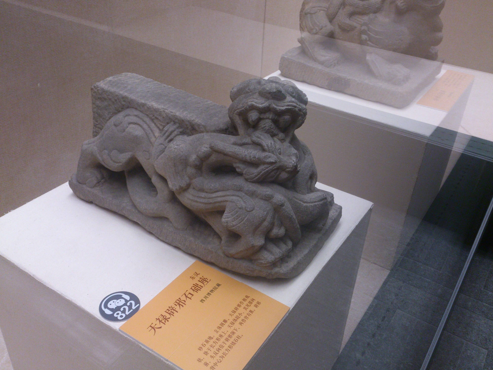

很早就听说省博有关于四川巴蜀文化的展览，一直很期待，前阵子因为端午放假等原因，一直未能成行，昨晚下定决心今天一定得去一趟，因为心里面一直对于神秘的巴蜀文化很有兴趣。

下午一点多，终于到达博物馆了，天气真热啊，走得我一身汗！先歇息一下，准备好微信导览[^1]，带好耳机后，出发到三楼的展厅！

一进门就是巴蜀的大地图，然后是相应的一些玉璧还有武器和生活炊具。

[photos]

[/photos]

然后是看到巴蜀的图语/图形文字，主要分布在铜兵器、铜乐器等等上，可以参考[巴蜀图语](http://baike.baidu.com/view/876679.htm)

[photos]

[/photos]

看完了这些青铜器（其实都比较没意思），接着就是比较有意思的了，汉代的画像砖。汉代的巴蜀人居然会将各种生活情景、想象、建筑都做出画像砖来，惟妙惟肖。

[photos]

[/photos]

接着是一对我比较喜欢的瑞兽石础座，[天禄](http://baike.baidu.com/subview/302217/6241886.htm)和[辟邪](http://baike.baidu.com/subview/119172/8136926.htm)，说实话，我文化不高，并不认识天禄和辟邪这两样瑞兽。据博物馆微信导览，天禄体较小，其尾部向前，头反向位于辟邪额下，两兽都有翼，一般认为有双脚者为天禄，无脚者为辟邪，寓意“天赐福禄”。但是我看百度百科上两者都有翼有脚，这里就不深究了。

[photos]

[/photos]

[^1]: 馆内有给手机充电的地方，有各种适配的充电线，还有WIFI，但是不知道为什么今天我死活连不上，只好用流量了。