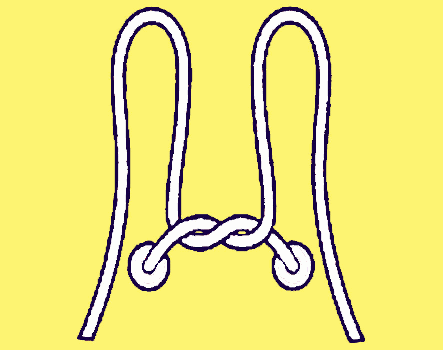
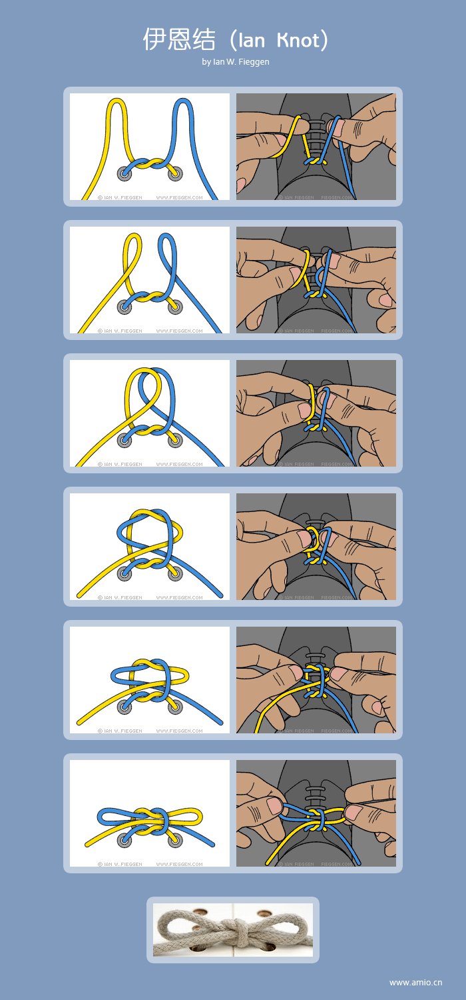

受『[比特新声](http://www.bitvoice.xyz/)』安利，平日里会时不时地看一下『[利器](http://liqi.io/)』，这是『离线』杂志搞的一个网站，一开始是采访优秀的创造者，邀请他们来分享工作时所使用的工具，以及使用工具的方式和原则；然后慢慢丰富到有周报，群分享等内容，可以说是越来越丰富。

今天就给大家安利一发这个『伊恩结』！伊恩结是在『利器』的[某一期周报](http://liqi.io/weekly002/)看到的。众所周知，我们现在系鞋带用的最多的应该是蝴蝶结。蝴蝶结其实不算方便，而且容易松开；而这个伊恩结却有着蝴蝶结相似的系法（所以有着相似的外观），而且~~说不会松开~~不会比蝴蝶结不容易掉。所以还是有学习的价值的。

如何系一个“伊恩结”？简单来说，俩手拇指和食指各拿根鞋绳，一边正转，一边反转，然后一系就可以了。

>豆豆 | 程序猿：推荐个系鞋带的方法，好看不松。就比蝴蝶结多绕一次，系出来还是比较美观的，剧烈运动也不会松。

上图还是看不懂，没关系，很正常，看看分解步骤：

实测效果熟练后确实会比蝴蝶结要快，但是还是有松开的情况。

Reference:

 - [如何防止鞋带松掉？|知乎](https://www.zhihu.com/question/20093377#answer-700224)
 - [伊恩结(Ian Knot)](http://www.amio.cn/blog/2007/11/how-to-tie-an-ian-knot/)