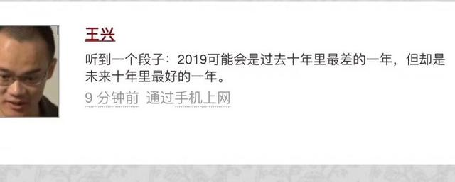
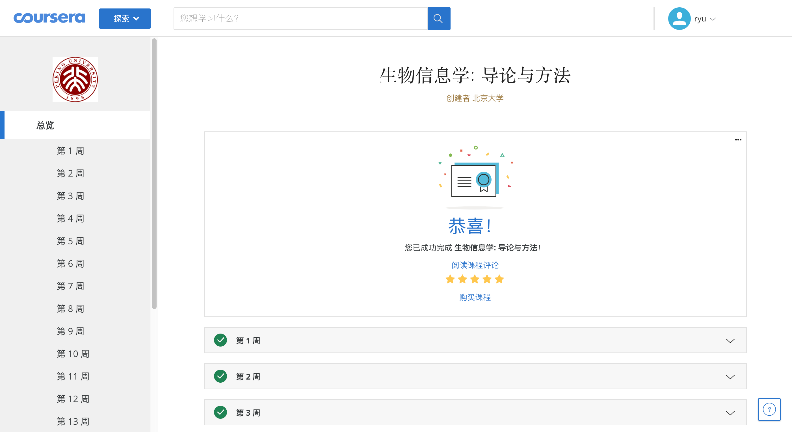
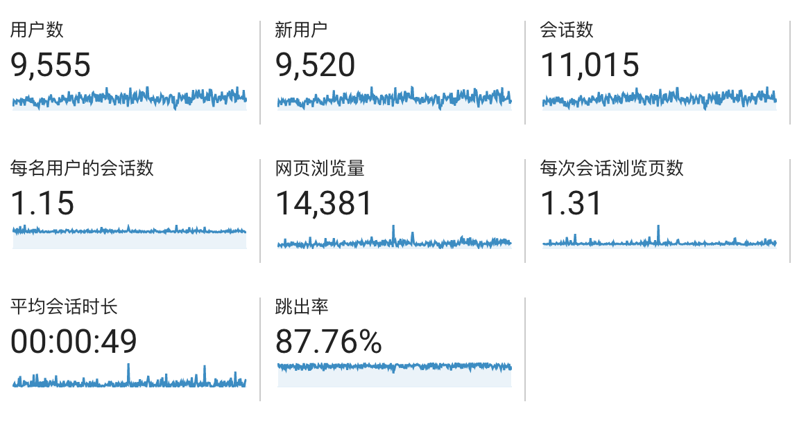

>“听到一个段子：2019 年可能会是过去十年里最差的一年，但却是未来十年里最好的一年。”
>——美团 王兴

好像离18年年终总结，才没过几个月的时间，19年就悄然结束了。相比上一年，今年做出了很多第一次的尝试，因此也多了很多跟其他同龄人的交流，收获了不少大家处于相似阶段的体会。

## 工作

去年年底裸辞，就连社保都断交了，过年后，在面试了好几家公司后，挑选了一个符合自己意愿的offer，继续从事NGS的生物信息学数据分析的工作，不过相比以前，反而专注生物信息学和程序本身，有和团队一起开发生信的软件，也有捡起HTML+CSS+JavaScript来开发工具。

若论影响最大的，莫过于机器学习。以前我对于机器学习只处于稍微读过公众号的阶段，觉得机器学习在目前的生活和工作中用不上，而且深度学习需要的成本也颇高，对于个人，是没有条件去学习或者实践的。机缘巧合的条件下，今年更加深入地了解机器学习，同时由于自己也在学习各种算法，对我造成的震撼还是很大的。我认为机器学习，不需要牵涉到大数据那么高的层面，反而是一类新的算法，用于辅助人们在有限的成本下，找到近似最优解。

## 学习

今年，给自己定了许多学习计划，有一些还未完成；有成就感的是，将北京大学的《生物信息学导论》重新刷了一遍。在我刚毕业那会，其实就看过一次，但是当时刚入行，里面有很多不会用到的、太过深奥的，自己就跳过了，所以今年才要求自己完完全全重新学习一遍。我是在Coursera上学习的，在ipad上缓存好，然后就在通勤的时间里一点一点看完。

## 消费

2019年的消费，依旧是一些订阅服务，费用与去年差不多。强力推荐Office 365的订阅，1T的Onedrive存储，真的很好用！

 - 终于购入了年轻人的第一台macbook pro，生产力，不需要解释；
 - iPad Pro 10.5寸 + Apple Pencil，我在通勤路上，看了很多视频教程，也用MarginNote来看文献；
 - 雅马哈 F600，学了一首生日歌唱给女友听，不过目前闲置ing🤦‍♂️

## 输出

今年博客较去年多更了一些，总共7篇日志，还是不理想。不过今年发的大部分都是较长的一些经验记录，所以也不算水，还要督促自己，有什么好的想法，就要及时记录，不要拖延到忘记。

博客的阅读量相比上年，其实是差不多的；今年尝试过重新用Typecho来搭建博客，感觉还不错；现在则是Github Page + Maverick来生成静态博客，希望来年能多输出有价值的文章给大家。

## 生活

今年搬了一次家，换了一个更好的环境，虽然通勤时间长了些，却也正好我可以沿途听听播客、看看视频。

今年还试过去野餐，铺上一张野餐布，躺在上面吃点心，2个人一起玩switch，原来在大城市里还有那么闲暇的下午时光。

## 2020

>最后，这几天我常常在想， 这个十年只剩下了最后一个月，二十一世纪 10 年代马上就要过去了，这个十年期我到底做了哪些事情，达到了十年前我对自己的期望吗。
> ——科技爱好者周刊：第 83 期（20191122）

前几天，在V2EX，看到这篇[2010-2020 我错过的黄金十年](https://iwenson.com/2010-2020-lost-golden-decade/)，如果有什么新兴的事物，你想去做，就抓紧时间去做，10年里新兴的事物太多，你能赶上抓住的太少。

2020年的目标，

 - 用Python写一个包，开源在Github上
 - 从头到尾地看完几本书，并做好笔记
 - 掌握R等语言
 - 养成锻炼的习惯，减掉一身的肥肉

前几天和同事吃饭才说起，以前过年时，试过大年三十晚上出门给我爸找手机充值，那时候还没有支付宝充值这些，大家过年也是互相发短信祝福。其实现在想想，也就是几年前的事，但是智能手机和移动支付的时代来得是如此迅猛；十年后，2029年时我写的年终总结会是什么样。。。。。。