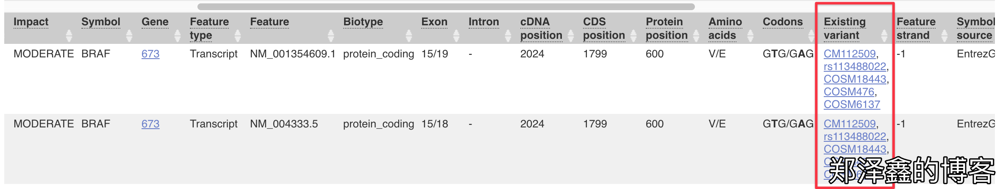
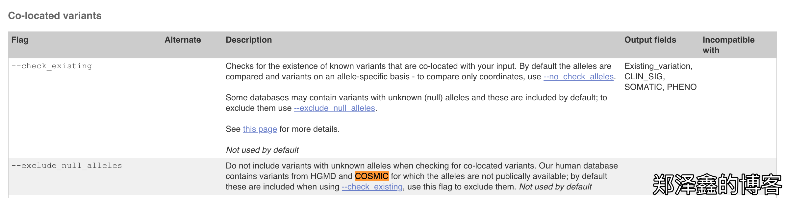
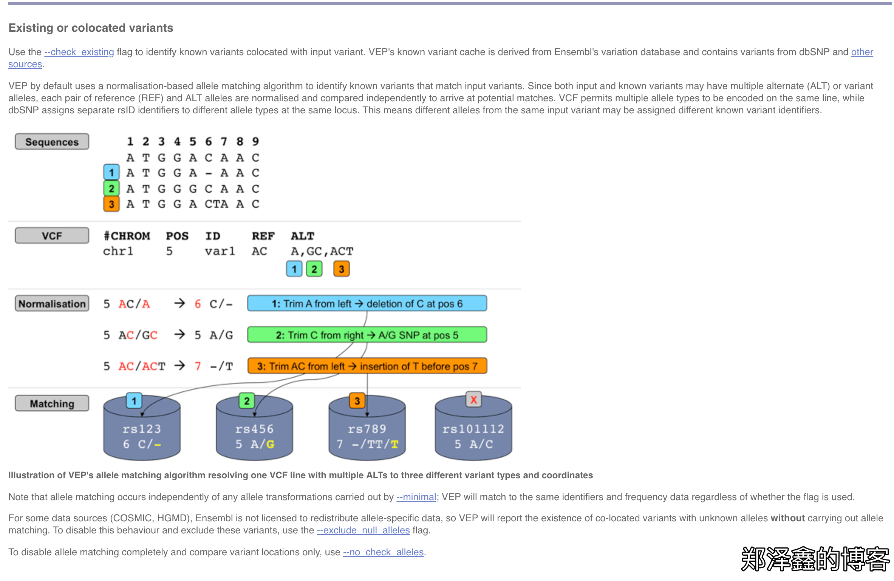

工作中有用到VEP，确实是一款出色的注释软件。相比ANNOVAR，最大的优点是支持HGVS标准的注释。

可能由于ANNOVAR面世比较早，当时很多变异描述的标准还没有通行，ANNOVAR采取的是按照基因组来`left-normalization`的方法，而HGVS的标准，则是根据基因/转录本的方向来`left-normalization`，因此有可能有的基因与ANNOVAR注释的方向相反。在某些地方，如`delins`的突变，ANNOVAR与VEP的注释也会不相同，当然，我们还是认为两者都是很出色的注释软件。（关于注释软件的比较，可以看看Golden Helix的这篇文章，http://blog.goldenhelix.com/goldenadmin/the-sate-of-variant-annotation-a-comparison-of-annovar-snpeff-and-vep/）

这次，主要是[记录一个VEP关于COSMIC注释的坑](https://zhengzexin.com/bioinfo/ji-lu-vepguan-yu-cosmiczhu-shi-de-yi-ge-keng)，避免大家以后踩到。事情的缘由，还是Ryu的一个同事，发现在一个Somatic突变上，VEP注释了多个COSMIC记录，而查证后却发现，很多事不正确的。

比如，我们用编号为`COSM476`的`BRAF:V600E`来举例：

可见，VEP确实注释了多个COSMIC ID，但只有`COSM476`才是正确的。What？这是怎么发生的。

于是Ryu就去查VEP的文档，终于被我发现了原因。VEP注释是可以注释COSMIC的记录的，但是这个注释，主要是根据染色体坐标而进行的`co-located variants`注释，没有判断这个突变是什么碱基变化的。

那么为什么要这么做呢？VEP明显是可以实现分辨碱基突变的功能的。援引VEP的原文，原来Ensembl并没有COSMIC、HGMD等数据库的精细到碱基突变的使用许可协议，因此这些数据能够被注释，但是却是换了一个方法，只能精细到染色体位置的层级。

>For some data sources (COSMIC, HGMD), Ensembl is not licensed to redistribute allele-specific data, so VEP will report the existence of co-located variants with unknown alleles without carrying out allele matching. To disable this behaviour and exclude these variants, use the --exclude_null_alleles flag.

看到这里，不禁感叹外国人对于版权的意识。在国内，可能COSMIC的注释，分分钟就被人注释上去了，也不会有人追究。其实ANNOVAR的COSMIC注释也止步更新于V70，而现在的COSMIC版本都已经快V90了。

大家以后使用VEP的时候，不要直接使用注释其中的COSMIC记录哦。